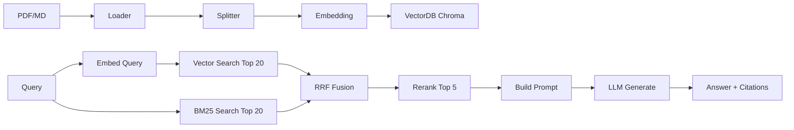

# 第 6 周:RAG 系统深入 ⭐⭐⭐

## 本周目标
- 深入理解 RAG 的工作原理与各环节
- 掌握文档加载、切分、向量化、检索、重排、生成全流程
- 熟练使用至少 2 个向量数据库(Chroma + Milvus 或 Qdrant)
- 掌握 LangChain RAG 框架核心组件
- 完成一个完整的中文文档问答系统

## 前置准备
- [ ] 完成 Week 1-5
- [ ] Docker Desktop 可用
- [ ] 安装:`pip install langchain langchain-community langchain-openai chromadb pymilvus qdrant-client sentence-transformers rank-bm25`
- [ ] 准备一份要做问答的文档(PDF/Markdown/Word,1-100 页都行)

---

## Day 1 - RAG 全貌 + Embedding 基础

**主题**:理解 RAG 为何存在,Embedding 是什么

### 上午(3h)理论学习
- [ ] RAG 全景图(1h)
  - 为什么需要 RAG:LLM 的知识局限、幻觉、私有数据
  - RAG 流程:索引(Indexing)+ 检索(Retrieval)+ 生成(Generation)
  - 索引流程:Load → Split → Embed → Store
  - 检索流程:Query → Embed → Search → Rerank → Context
- [ ] Embedding 详解(2h)
  - 词向量 → 句向量 → 文档向量
  - 主流 Embedding 模型对比:
    - OpenAI `text-embedding-3-small/large`
    - BGE 系列(智源,中文强):`BAAI/bge-large-zh-v1.5`、`BAAI/bge-m3`
    - M3E:`moka-ai/m3e-base`
    - 通义千问 `text-embedding-v2/v3`
  - 维度、长度限制、速度、成本对比
  - MTEB 榜单:https://huggingface.co/spaces/mteb/leaderboard

### 下午(3h)动手实践
- [ ] 手动跑通 Embedding(1.5h)
  - 用 `sentence-transformers` 加载 `BAAI/bge-large-zh-v1.5`
  - 编码 5 段中文文本
  - 计算两两余弦相似度
  - 提交到 `week06/day1/embedding_basics.ipynb`
- [ ] 对比 3 个 Embedding 模型在中文上的效果(1.5h)
  - 构造 10 对"相似/不相似"的句子对
  - 用 BGE / M3E / OpenAI Embedding 分别计算
  - 哪个模型语义判断更准?

### 晚上(2h)整理与提交
- [ ] 整理"Embedding 模型选型指南"
- [ ] commit & push
- [ ] 填写每日总结

### 今日交付物
- [ ] Embedding 基础 notebook
- [ ] 3 模型对比报告

### 推荐资源
- BGE 模型:https://github.com/FlagOpen/FlagEmbedding
- MTEB 榜单:https://huggingface.co/spaces/mteb/leaderboard
- The Illustrated Word2vec(回顾):https://jalammar.github.io/illustrated-word2vec/

---

## Day 2 - 向量数据库

**主题**:Chroma / Qdrant / Milvus / PgVector 对比与实战

### 上午(3h)理论学习
- [ ] 向量索引算法(1.5h)
  - 暴力搜索 vs ANN(近似最近邻)
  - HNSW、IVF、PQ 算法直觉
  - 召回率与速度的权衡
- [ ] 主流向量库对比(1.5h)
  | 向量库 | 特点 | 适合场景 |
  |--------|------|---------|
  | Chroma | 轻量、内嵌 | 本地开发、原型 |
  | Qdrant | Rust 实现、性能好 | 生产中小规模 |
  | Milvus | 分布式、功能全 | 大规模生产 |
  | PgVector | PostgreSQL 扩展 | 已有 PG 的团队 |
  | FAISS | Facebook 开源、纯库 | 嵌入式、离线 |
  | Pinecone | 商业云服务 | 不想运维 |

### 下午(3h)动手实践
- [ ] Chroma 实战(1h)
  - Docker 启动:`docker run -p 8000:8000 chromadb/chroma`
  - 创建 collection、插入向量、相似度搜索
  - 元数据过滤
- [ ] Qdrant 实战(1h)
  - Docker 启动:`docker run -p 6333:6333 qdrant/qdrant`
  - 同样的操作复现
- [ ] Milvus 实战(1h)
  - 用 docker-compose 启动 Milvus Standalone
  - 同样的操作复现
  - 体会三者 API 差异

### 晚上(2h)整理与提交
- [ ] 整理"向量库 API 对照表"
- [ ] commit & push
- [ ] 填写每日总结

### 今日交付物
- [ ] 3 个向量库的实战代码
- [ ] API 对照表

### 推荐资源
- Chroma 文档:https://docs.trychroma.com/
- Qdrant 文档:https://qdrant.tech/documentation/
- Milvus 文档:https://milvus.io/docs

---

## Day 3 - 文档加载与切分(Chunking)

**主题**:RAG 效果的 50% 取决于切分质量

### 上午(3h)理论学习
- [ ] 文档加载(1h)
  - PDF:`pypdf`、`pdfplumber`、`PyMuPDF`(`fitz`)
  - Word:`python-docx`
  - Markdown:`markdown` + 解析器
  - HTML:`BeautifulSoup`、`unstructured`
  - 表格、图片处理(`unstructured`、`docling`)
- [ ] 切分策略(2h)
  - **固定长度切分**:简单但容易切坏语义
  - **按 token 切分**:对齐模型上下文
  - **按分隔符**:段落/章节
  - **递归切分(RecursiveCharacterTextSplitter)**:LangChain 默认推荐
  - **语义切分**:基于句子 Embedding 相似度
  - **结构化切分**:Markdown 标题感知、代码块感知
  - **关键参数**:`chunk_size` / `chunk_overlap`
  - 中文切分的特殊性

### 下午(3h)动手实践
- [ ] 4 种切分策略对比(2h)
  - 同一份 PDF(选你的目标文档),用 4 种策略切分
  - 观察切分块的长度分布、语义完整性
  - 提交到 `week06/day3/chunking_compare.ipynb`
- [ ] 实现一个 Markdown 标题感知切分器(1h)
  - 保留标题层级信息(便于显示来源)
  - 提交到 `week06/day3/markdown_splitter.py`

### 晚上(2h)整理与提交
- [ ] 整理"切分策略选型指南"
- [ ] commit & push
- [ ] 填写每日总结

### 今日交付物
- [ ] 切分策略对比报告
- [ ] Markdown 切分器实现

### 推荐资源
- LangChain Text Splitters:https://python.langchain.com/docs/concepts/text_splitters/
- Unstructured 库:https://github.com/Unstructured-IO/unstructured

---

## Day 4 - 检索策略 + 混合检索 + Rerank

**主题**:让 RAG 真正"找得准"

### 上午(3h)理论学习
- [ ] 检索策略(1.5h)
  - 向量检索(Dense Retrieval):语义相似
  - BM25 关键词检索(Sparse Retrieval):精确匹配
  - **混合检索(Hybrid Search)**:两者结合 + RRF 融合
  - 元数据过滤(metadata filter)
  - 多查询(Multi-Query):用 LLM 改写查询
  - HyDE(假设性文档嵌入):用 LLM 生成"假答案"再检索
- [ ] 重排序(Rerank)(1.5h)
  - 为什么需要 Rerank:Embedding 相似 ≠ 真正相关
  - Cross-Encoder vs Bi-Encoder
  - 主流 Rerank 模型:
    - `BAAI/bge-reranker-large`(中文强)
    - Cohere Rerank API
    - Jina Reranker
  - **典型流水线**:Embedding 粗排 Top 20 → Rerank 精排 Top 5

### 下午(3h)动手实践
- [ ] 实现混合检索(2h)
  - 用 `rank_bm25` 实现 BM25
  - 用 Chroma 实现向量检索
  - 用 RRF(Reciprocal Rank Fusion)融合
  - 提交到 `week06/day4/hybrid_search.py`
- [ ] 加入 Rerank(1h)
  - 加载 `BAAI/bge-reranker-large`
  - 在混合检索后做精排
  - 对比 with/without rerank 的命中率

### 晚上(2h)整理与提交
- [ ] 整理"检索流水线设计模板"
- [ ] commit & push
- [ ] 填写每日总结

### 今日交付物
- [ ] 混合检索 + Rerank 完整代码
- [ ] 检索效果对比表

### 推荐资源
- BGE Reranker:https://github.com/FlagOpen/FlagEmbedding
- 综述:https://arxiv.org/abs/2312.10997(Retrieval-Augmented Generation for Large Language Models)

---

## Day 5 - LangChain RAG 框架 + 评估

**主题**:用框架快速搭建 + 如何评估 RAG 效果

### 上午(3h)理论学习
- [ ] LangChain 核心抽象(1.5h)
  - `DocumentLoader` / `TextSplitter` / `Embeddings` / `VectorStore` / `Retriever` / `LLM`
  - LCEL(LangChain Expression Language)
  - Runnable 接口(类比 Java Stream)
- [ ] RAG 评估(1.5h)
  - 检索指标:Recall@K、MRR、Hit Rate
  - 生成指标:Faithfulness(忠实度)、Answer Relevance(答案相关性)、Context Precision
  - 工具:**Ragas**、**TruLens**、**LangSmith / LangFuse**
  - 评估数据集如何构造(可用 LLM 生成)

### 下午(3h)动手实践
- [ ] 用 LangChain 重写昨天的 RAG(1.5h)
  - `RecursiveCharacterTextSplitter` + `HuggingFaceEmbeddings` + `Chroma` + `LCEL` Chain
  - 对比"手撸"和"框架"的代码量
  - 提交到 `week06/day5/langchain_rag.py`
- [ ] 用 Ragas 评估 RAG 效果(1.5h)
  - 准备 20 个"问题-答案"对
  - 跑 Ragas 评估 faithfulness、answer_relevance
  - 提交评估报告到 `week06/day5/ragas_eval.ipynb`

### 晚上(2h)整理与提交
- [ ] 整理"RAG 评估清单"
- [ ] commit & push
- [ ] 填写每日总结

### 今日交付物
- [ ] LangChain RAG 实现
- [ ] Ragas 评估报告

### 推荐资源
- LangChain RAG:https://python.langchain.com/docs/tutorials/rag/
- Ragas:https://docs.ragas.io/
- LangFuse:https://langfuse.com

---

## Day 6 - 本周综合项目:中文 PDF 问答系统

**主题**:从零搭建一个企业级 RAG 雏形

### 上午(3h)项目设计
- [ ] 选定文档(1h)
  - 推荐:某个开源项目的中文文档、《Java 编程思想》PDF、公司内部 wiki 等
  - 至少 50 页
- [ ] 工程结构(2h)
  ```
  pdf_qa/
  ├── README.md
  ├── docs/                # 放 PDF 等源文件
  ├── data/                # 索引后的数据
  ├── src/
  │   ├── loader.py        # 文档加载
  │   ├── splitter.py      # 切分
  │   ├── indexer.py       # 索引构建(运行一次)
  │   ├── retriever.py     # 混合检索 + Rerank
  │   ├── generator.py     # 调用 LLM 生成
  │   ├── pipeline.py      # 串联
  │   └── eval.py          # 评估脚本
  ├── prompts/
  │   ├── qa.txt
  │   └── eval.txt
  ├── config.yaml
  └── app.py               # Gradio 界面 + 引用来源显示
  ```

### 下午(3h)动手实践
- [ ] 实现索引构建脚本(1h)
- [ ] 实现检索 + 生成流水线(1.5h)
- [ ] Gradio 界面,显示答案 + 引用来源 + 评分(30min)

### 晚上(2h)收尾与提交
- [ ] 准备 10 个测试问题,记录回答质量
- [ ] 完善 README + 架构图
- [ ] commit & push
- [ ] 填写每日总结

### 今日交付物
- [ ] 完整的 PDF 问答系统
- [ ] 至少 10 个问题的回答记录
- [ ] 架构图(可用 mermaid)

### 项目架构参考



---

## Day 7 - 复盘 + 自由学习

### 上午(3h)复盘
- [ ] 填写"本周复盘"
- [ ] RAG 系统的 10 个问题中,哪些回答不准?分析原因(切分?检索?Rerank?LLM?)
- [ ] 自评里程碑

### 下午(3h)自由学习
- 选项 A:深度优化 RAG(尝试 Multi-Query / HyDE / 父子文档检索)
- 选项 B:学习 GraphRAG、Self-RAG 等前沿方向
- 选项 C:写一篇博客《我从零搭了一个中文 RAG 系统》
- 选项 D:休息 ✅

### 晚上(2h)
- [ ] 预读 `week-07-agent.md`
- [ ] 复习 Function Calling(Week 5 Day 4)

---

## 本周里程碑检查

- [ ] 能解释 RAG 的完整链路
- [ ] 能用至少 2 个向量库构建索引
- [ ] 能实现混合检索 + Rerank
- [ ] 能用 Ragas 评估 RAG 系统
- [ ] 有 1 个可演示的中文 RAG 项目

## 本周资源汇总

### 文档
- LangChain RAG Tutorial:https://python.langchain.com/docs/tutorials/rag/
- LlamaIndex(另一个 RAG 框架):https://docs.llamaindex.ai/
- Ragas:https://docs.ragas.io/

### 论文(选读)
- 《Retrieval-Augmented Generation for Large Language Models: A Survey》(2023, 必读综述)
- 《Self-RAG》(2023)
- 《GraphRAG》(2024, 微软)

### 工具榜单
- MTEB Embedding 榜单:https://huggingface.co/spaces/mteb/leaderboard
- C-MTEB 中文榜单:https://huggingface.co/spaces/mteb/leaderboard(切到 Chinese tab)

---

## 本周复盘

### 完成度自评
- 整体完成度:____ / 7 天
- 学习时长统计:____ 小时
- GitHub commit 数:____
- RAG 问答正确率(主观估计):____%

### 收获最大的三个点
1.
2.
3.

### RAG 关键认知
- 切分最影响:
- 检索最影响:
- 生成最影响:

### 最大的卡点
-

### 下周(Agent)需要重点关注
-
