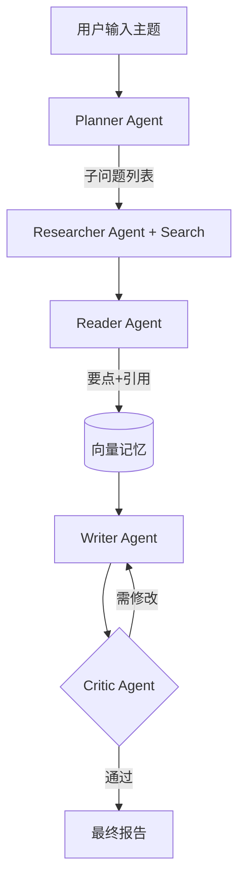

# 第 7 周:Agent 与工具调用 ⭐⭐⭐

## 本周目标
- 理解 Agent 的本质与各种设计模式(ReAct、Plan-and-Execute)
- 掌握 LangChain Agent / LangGraph 框架
- 实现多 Agent 协作系统
- 掌握 MCP(Model Context Protocol)协议(2025-2026 热点)
- 完成一个有实用价值的 Agent 应用

## 前置准备
- [ ] 完成 Week 1-6
- [ ] 安装:`pip install langchain langgraph langchain-openai langchain-community`
- [ ] 准备至少 2 个真实可调用的工具(如:天气 API、Tavily 搜索 API)
- [ ] 注册 Tavily 搜索 API(免费):https://tavily.com

---

## Day 1 - Agent 核心概念 + ReAct 模式

**主题**:Agent 不是魔法,理解其工作机制

### 上午(3h)理论学习
- [ ] Agent 的本质(1h)
  - LLM + Tools + Memory + Planning = Agent
  - 与普通 Chatbot 的区别
  - 与 Function Calling 的关系(Agent 是 Function Calling 的循环)
- [ ] ReAct 模式(2h)
      论文:https://arxiv.org/abs/2210.03629
  - Thought(思考)→ Action(行动)→ Observation(观察)→ ... 循环
  - 为什么有效:让 LLM 把"思考"显式化
  - 与"直接调用 Function Calling"的区别(更可控、可解释)
  - 经典 Prompt 模板

### 下午(3h)动手实践
- [ ] 手写一个最简 ReAct Agent(2h)
  - 不用任何框架,纯 OpenAI/DeepSeek API
  - 工具:`search(query)`、`calculator(expr)`
  - 实现 Thought-Action-Observation 循环
  - 限制最大轮数
  - 提交到 `week07/day1/react_agent.py`
- [ ] 用 LangChain Agent 实现同样功能对比(1h)
  - `create_react_agent`
  - 体会框架带来的便利与局限
  - 提交到 `week07/day1/langchain_react.py`

### 晚上(2h)整理与提交
- [ ] 整理"ReAct 工作流程图"
- [ ] commit & push
- [ ] 填写每日总结

### 今日交付物
- [ ] 手写 ReAct Agent
- [ ] LangChain Agent 对比版

### 推荐资源
- ReAct 论文:https://arxiv.org/abs/2210.03629
- LangChain Agent 文档:https://python.langchain.com/docs/concepts/agents/

---

## Day 2 - 工具设计 + Function Calling 进阶

**主题**:好工具是 Agent 成功的一半

### 上午(3h)理论学习
- [ ] 工具设计原则(1.5h)
  - **单一职责**:一个工具做一件事
  - **清晰命名与描述**:模型靠描述判断何时调用
  - **参数 schema 明确**:用 Pydantic 或 JSON Schema
  - **错误信息友好**:让 LLM 能看懂并恢复
  - **幂等性**:同样输入同样输出(便于缓存)
  - **超时与限流**
- [ ] 工具类型分类(1.5h)
  - 信息检索类:web search、知识库查询、SQL 查询
  - 计算类:计算器、代码执行、统计
  - 写入类:发邮件、创建工单、修改数据库
  - 外部 API:天气、地图、第三方服务
  - **危险工具**:文件写入、Shell 执行(必须人工确认)

### 下午(3h)动手实践
- [ ] 实现 5 个高质量工具(2h)
  - `web_search(query)`:用 Tavily
  - `python_repl(code)`:用 LangChain `PythonREPLTool`
  - `read_file(path)` / `write_file(path, content)`
  - `sql_query(sql)`:连接 SQLite
  - `send_email(to, subject, body)`:用 SMTP(可 Mock)
  - 每个工具都用 Pydantic 定义 schema
  - 提交到 `week07/day2/tools/`
- [ ] 构建一个 Agent,接入上述工具(1h)
  - 测试 5 个真实任务,如:
    - "搜索一下 OpenAI 最新动态,写到 news.md 文件"
    - "查 users 表中 age > 30 的用户数"

### 晚上(2h)整理与提交
- [ ] 整理"工具设计 Checklist"
- [ ] commit & push
- [ ] 填写每日总结

### 今日交付物
- [ ] 5 个高质量工具
- [ ] Agent 真实任务测试报告

### 推荐资源
- Tavily 搜索 API:https://tavily.com
- LangChain Tools:https://python.langchain.com/docs/integrations/tools/

---

## Day 3 - Memory + 多轮对话

**主题**:Agent 的"记忆"系统

### 上午(3h)理论学习
- [ ] 记忆类型(1.5h)
  - **短期记忆**:对话窗口(Conversation Buffer)
  - **滑动窗口记忆**:只保留最近 N 轮
  - **摘要记忆**:用 LLM 持续生成摘要
  - **向量记忆**:把历史对话存向量库,按相关性检索(类似 RAG)
  - **实体记忆**:抽取并维护实体信息
- [ ] LangChain Memory API(1.5h)
  - `ConversationBufferMemory`
  - `ConversationSummaryMemory`
  - `VectorStoreRetrieverMemory`
  - 在 LCEL Chain 中如何接入

### 下午(3h)动手实践
- [ ] 实现 4 种 Memory 对比(2h)
  - 同一个长对话(20+ 轮),用 4 种 Memory 跑
  - 测试 token 消耗、回答准确性、上下文一致性
  - 提交到 `week07/day3/memory_compare.py`
- [ ] 实现一个个性化记忆 Bot(1h)
  - 用户每次说话,Agent 抽取关键信息存到本地 JSON
  - 下次对话时加载用户偏好

### 晚上(2h)整理与提交
- [ ] 整理"Memory 选型指南"
- [ ] commit & push
- [ ] 填写每日总结

### 今日交付物
- [ ] 4 种 Memory 对比报告
- [ ] 个性化记忆 Bot

### 推荐资源
- LangChain Memory:https://python.langchain.com/docs/how_to/#memory

---

## Day 4 - LangGraph + 复杂 Agent 编排

**主题**:超越 ReAct 的状态机式 Agent 编排

### 上午(3h)理论学习
- [ ] LangGraph 核心(2h)
      https://langchain-ai.github.io/langgraph/
  - 为什么需要它:ReAct 不够灵活、状态管理混乱
  - 核心概念:Graph、Node、Edge、State
  - 条件边(Conditional Edge)
  - 循环与中断
  - **类比 Java**:像状态机框架 Spring StateMachine
- [ ] 高级 Agent 模式(1h)
  - Plan-and-Execute(先计划再执行)
  - Reflection(反思自我修正)
  - Multi-Agent Collaboration(多角色协作)
  - Hierarchical Agent(层级 Agent)

### 下午(3h)动手实践
- [ ] 用 LangGraph 重写一个 ReAct Agent(1.5h)
  - 定义 State(messages, tool_results)
  - 定义节点:`call_model` / `call_tool`
  - 条件边:LLM 决定是否调用工具
  - 提交到 `week07/day4/langgraph_react.py`
- [ ] 实现一个 Plan-and-Execute Agent(1.5h)
  - 步骤 1:Planner LLM 拆解任务
  - 步骤 2:Executor 逐步执行
  - 步骤 3:Replanner 根据执行结果调整
  - 测试任务:"分析最近 7 天 OpenAI 新闻并写一份 markdown 报告"

### 晚上(2h)整理与提交
- [ ] 整理"LangGraph 工程模板"
- [ ] commit & push
- [ ] 填写每日总结

### 今日交付物
- [ ] LangGraph ReAct 版本
- [ ] Plan-and-Execute Agent

### 推荐资源
- LangGraph 文档(必读):https://langchain-ai.github.io/langgraph/
- LangGraph Tutorials:https://langchain-ai.github.io/langgraph/tutorials/

---

## Day 5 - 多 Agent 协作 + MCP 协议

**主题**:2025-2026 最热的两个方向

### 上午(3h)理论学习
- [ ] 多 Agent 协作模式(1.5h)
  - Supervisor 模式:一个主管 Agent 派发任务
  - Swarm 模式:扁平协作
  - 角色分工:Researcher / Writer / Critic / Coder
  - 主流框架对比:LangGraph / CrewAI / AutoGen / Microsoft Magentic-One
- [ ] MCP(Model Context Protocol)(1.5h)
      https://modelcontextprotocol.io/
  - 由 Anthropic 提出的开放协议
  - **类比**:像 USB-C 之于 LLM 工具生态
  - Server(提供工具/资源)+ Client(LLM 应用)
  - 已有大量开源 MCP Server:文件系统、Git、Slack、PostgreSQL...
  - Spring AI 在 2025 年已支持 MCP

### 下午(3h)动手实践
- [ ] 用 LangGraph 实现 Supervisor 多 Agent(1.5h)
  - 角色:Researcher(搜索)、Coder(写代码)、Writer(整理报告)
  - 任务:"调研 RAG 优化策略并写一份代码示例"
  - 提交到 `week07/day5/multi_agent.py`
- [ ] 跑通一个 MCP Server + Client(1.5h)
  - 安装 MCP Python SDK:`pip install mcp`
  - 跑通官方 filesystem MCP Server
  - 用 Claude Desktop 或自写客户端连接
  - 体会"工具即插即用"
  - 提交到 `week07/day5/mcp_demo/`

### 晚上(2h)整理与提交
- [ ] 整理"多 Agent 模式对比"
- [ ] 整理"MCP 简介与上手指南"
- [ ] commit & push
- [ ] 填写每日总结

### 今日交付物
- [ ] 多 Agent 协作示例
- [ ] MCP 上手 demo

### 推荐资源
- MCP 官方:https://modelcontextprotocol.io/
- MCP Servers 列表:https://github.com/modelcontextprotocol/servers
- CrewAI:https://docs.crewai.com/
- AutoGen:https://microsoft.github.io/autogen/

---

## Day 6 - 本周综合项目:智能调研助手

**主题**:多 Agent + 工具 + RAG,做一个能"自主调研"的助手

### 上午(3h)项目设计
- [ ] 需求(1h)
  - 输入:一个调研主题(如:"2026 年 RAG 技术趋势")
  - 流程:
    1. Planner 拆解为 5-10 个子问题
    2. Researcher Agent 调用 Tavily 搜索每个子问题
    3. Reader Agent 阅读结果并提取要点(可缓存为向量库)
    4. Writer Agent 整合为 Markdown 报告
    5. Critic Agent 审查报告并给出修改建议
    6. Writer 根据反馈修订
  - 输出:一份带引用的 Markdown 调研报告
- [ ] 工程结构(2h)
  ```
  research_agent/
  ├── README.md
  ├── src/
  │   ├── agents/
  │   │   ├── planner.py
  │   │   ├── researcher.py
  │   │   ├── reader.py
  │   │   ├── writer.py
  │   │   └── critic.py
  │   ├── tools/
  │   │   ├── search.py
  │   │   └── memory.py    # 用向量库存中间结果
  │   ├── graph.py         # LangGraph 编排
  │   └── state.py         # 共享 State 定义
  ├── outputs/             # 生成的报告
  └── app.py               # Gradio 入口
  ```

### 下午(3h)动手实践
- [ ] 实现各 Agent(2h)
- [ ] LangGraph 编排(1h)

### 晚上(2h)测试与提交
- [ ] 跑 3 个不同主题测试
- [ ] 完善 README + Mermaid 流程图
- [ ] commit & push
- [ ] 填写每日总结

### 今日交付物
- [ ] 完整的智能调研助手
- [ ] 3 份自动生成的调研报告

### 项目架构(Mermaid)



---

## Day 7 - 复盘 + 自由学习

### 上午(3h)复盘
- [ ] 填写"本周复盘"
- [ ] 调研助手的输出质量评估
- [ ] 自评里程碑

### 下午(3h)自由学习
- 选项 A:研究 Browser Use / Computer Use(2025 热点)
- 选项 B:深入 CrewAI 或 AutoGen
- 选项 C:写博客《我用多 Agent 做了一个调研助手》
- 选项 D:休息 ✅

### 晚上(2h)
- [ ] 预读 `week-08-spring-ai.md`(回归 Java 战场)
- [ ] 准备 JDK 17+、IntelliJ IDEA、Spring Initializr
- [ ] 复习 Spring Boot 基础

---

## 本周里程碑检查

- [ ] 能解释 ReAct 工作机制并手写一个
- [ ] 能用 LangGraph 编排复杂流程
- [ ] 能设计高质量工具(描述清晰、schema 完整)
- [ ] 实现过多 Agent 协作系统
- [ ] 跑通过 MCP Server/Client
- [ ] 有 1 个可演示的复杂 Agent 项目

## 本周资源汇总

### 文档
- LangGraph:https://langchain-ai.github.io/langgraph/
- MCP:https://modelcontextprotocol.io/
- CrewAI:https://docs.crewai.com/
- AutoGen:https://microsoft.github.io/autogen/

### 论文
- ReAct:https://arxiv.org/abs/2210.03629
- Reflexion:https://arxiv.org/abs/2303.11366
- Plan-and-Solve:https://arxiv.org/abs/2305.04091
- 综述《The Rise and Potential of Large Language Model Based Agents》

### 案例项目
- LangGraph 官方示例:https://github.com/langchain-ai/langgraph/tree/main/examples
- AutoGen Magentic-One

---

## 本周复盘

### 完成度自评
- 整体完成度:____ / 7 天
- 学习时长统计:____ 小时
- GitHub commit 数:____

### 收获最大的三个点
1.
2.
3.

### Agent 关键认知
- 工具设计最影响:
- Prompt 最影响:
- 编排框架最影响:

### 最大的卡点
-

### 阶段性总结(完成 LLM 核心三周后)
> Week 5-7 是主战场,你现在掌握了 LLM 应用开发的核心能力。Week 8 起回归 Java 战场,把这些能力用 Spring AI 集成进企业系统。

-
