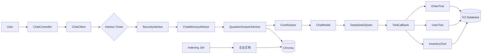

# 第 8 周:Spring AI ⭐ 你的护城河

## 本周目标
- 掌握 Spring AI 核心抽象与编程模型
- 用 Spring AI 实现 Chat / Embedding / VectorStore / RAG / Function Calling
- 整合 Spring Boot Web,做出企业级 AI 应用
- 把 Week 5-7 学到的能力"Java 化"

## 前置准备
- [ ] JDK 17 或 21 已安装
- [ ] Maven 3.9+ 或 Gradle 8+
- [ ] IntelliJ IDEA Ultimate(推荐)或 Community + Spring 插件
- [ ] 阅读 Spring AI 官方文档总览:https://docs.spring.io/spring-ai/reference/
- [ ] 准备一个 LLM API key(DeepSeek / DashScope / OpenAI)

---

## Day 1 - Spring AI 总览 + Chat Client

**主题**:Spring AI 解决什么问题,核心抽象是什么

### 上午(3h)理论学习
- [ ] Spring AI 价值与定位(1h)
  - 为什么有它:统一不同 LLM 厂商 API、与 Spring 生态无缝集成
  - 与 LangChain4j 的关系与差异
  - 当前版本(写计划时为 1.0.x)
- [ ] 核心抽象(2h)
  - `ChatClient`:统一的 Chat 接口(对照 Python OpenAI Client)
  - `ChatModel` / `EmbeddingModel` / `ImageModel`
  - `Prompt` / `Message` / `ChatResponse`
  - `Advisors`:类似 Spring AOP 的"增强器"(超重要)
  - `Function Calling`:`@Tool` 注解
  - `VectorStore`:统一向量存储接口
  - `Output Parser`:结构化输出

### 下午(3h)动手实践
- [ ] 创建 Spring Boot 项目(30min)
  - 用 Spring Initializr 选 `Web` + `Spring AI Chat`
  - 选择 LLM:推荐 `Spring AI OpenAI`(可对接 DeepSeek)或 `Spring AI DashScope`
  - 配置 API key 到 `application.yml`
- [ ] 第一个 ChatClient 调用(1h)
  - 注入 `ChatClient.Builder`
  - 实现 `/chat` 接口,接收 prompt 返回响应
  - 测试同步与流式调用
  - 提交到 `week08/day1/spring-ai-hello/`
- [ ] 流式响应(1.5h)
  - 返回 `Flux<String>`(SSE)
  - 用 Postman / curl 测试
  - 与前端集成(可选,Thymeleaf 或纯 JS)

### 晚上(2h)整理与提交
- [ ] 整理"Spring AI vs Python OpenAI SDK 对照"
- [ ] commit & push
- [ ] 填写每日总结

### 今日交付物
- [ ] 第一个 Spring AI 应用(GET /chat + 流式)
- [ ] 抽象对照笔记

### 推荐资源
- Spring AI 官方文档:https://docs.spring.io/spring-ai/reference/
- Spring AI GitHub Samples:https://github.com/spring-projects/spring-ai-examples

---

## Day 2 - Prompt 模板 + Output 结构化 + Memory

**主题**:工程化 Prompt 与对话管理

### 上午(3h)理论学习
- [ ] PromptTemplate(1h)
  - StringTemplate 风格变量替换
  - 从文件加载 prompt 模板
  - 多消息组合(SystemMessage + UserMessage)
- [ ] 结构化输出(1h)
  - `BeanOutputConverter<T>`:把 LLM 输出转为 Java 对象
  - `ListOutputConverter` / `MapOutputConverter`
  - 内部如何工作(添加 format 指令到 prompt)
- [ ] Chat Memory(1h)
  - `InMemoryChatMemory`
  - `JdbcChatMemory`(持久化到数据库)
  - 通过 Advisor 集成

### 下午(3h)动手实践
- [ ] 实现 Prompt 模板示例(1h)
  - 从 `resources/prompts/translate.st` 加载模板
  - 实现 `/translate?text=...&lang=...` 接口
- [ ] 结构化输出实战(1.5h)
  - 定义 `Recipe(String name, List<String> ingredients, List<String> steps)`
  - 实现 `/recipe?dish=红烧肉` 接口,返回 JSON
  - 与 Pydantic 版本对比
- [ ] 多轮对话 + Memory(30min)
  - 实现 `/chat/{conversationId}` 维持对话
  - 用 `MessageChatMemoryAdvisor`

### 晚上(2h)整理与提交
- [ ] 整理"Spring AI vs LangChain Python 对照表"
- [ ] commit & push
- [ ] 填写每日总结

### 今日交付物
- [ ] 翻译接口
- [ ] 菜谱生成接口(结构化)
- [ ] 多轮对话接口

### 推荐资源
- Output Converters:https://docs.spring.io/spring-ai/reference/api/structured-output-converter.html
- Chat Memory:https://docs.spring.io/spring-ai/reference/api/chatclient.html#_chat_memory

---

## Day 3 - Function Calling(@Tool 注解)

**主题**:让 Spring Bean 变成 LLM 工具

### 上午(3h)理论学习
- [ ] `@Tool` 注解机制(1.5h)
  - 注解扫描原理(类比 `@Service` / `@RestController`)
  - 工具描述、参数描述
  - Spring 上下文注入到工具方法
- [ ] 工具组织模式(1.5h)
  - 在 `@Service` Bean 中定义工具方法
  - 多个工具的命名空间管理
  - 工具调用的日志与监控
  - 工具调用安全(权限、限流)

### 下午(3h)动手实践
- [ ] 实现 5 个 Spring AI 工具(2h)
  - `WeatherTools.getWeather(String city)`
  - `DateTools.now()`、`DateTools.calculateAge(LocalDate birthday)`
  - `EmailTools.sendEmail(String to, String subject, String body)`(Mock)
  - `DatabaseTools.queryUsers(String filter)`(用 JdbcTemplate)
  - `MathTools.calculate(String expression)`
  - 用 `@Tool` 标注每个方法
  - 提交到 `week08/day3/spring-ai-tools/`
- [ ] 测试综合 Agent(1h)
  - 用 `ChatClient` + `.tools(weatherTools, dateTools, ...)` 注入
  - 测试任务:
    - "今天北京天气怎么样,然后发邮件告诉张三"
    - "查 users 表中所有 VIP 用户,计算他们的平均年龄"

### 晚上(2h)整理与提交
- [ ] 整理"Spring AI Tool 设计模式"
- [ ] commit & push
- [ ] 填写每日总结

### 今日交付物
- [ ] 5 个 Spring AI 工具
- [ ] 综合 Agent 测试用例

### 推荐资源
- Function Calling:https://docs.spring.io/spring-ai/reference/api/tools.html

---

## Day 4 - VectorStore + Embedding + RAG

**主题**:Spring AI 的 RAG 能力

### 上午(3h)理论学习
- [ ] EmbeddingModel(1h)
  - `OpenAiEmbeddingModel` / `DashScopeEmbeddingModel`
  - 本地 Embedding:`TransformersEmbeddingModel`(ONNX)
  - 调用 `embed(String text)` 与 `embed(List<String>)`
- [ ] VectorStore 抽象(1h)
  - `SimpleVectorStore`(内存,demo 用)
  - `RedisVectorStore`、`PgVectorStore`、`MilvusVectorStore`、`ChromaVectorStore`
  - `Document` 对象与元数据
  - `SearchRequest`:topK、相似度阈值、过滤
- [ ] ETL Pipeline(1h)
  - `DocumentReader`:`TikaDocumentReader`、`PdfDocumentReader`、`MarkdownDocumentReader`
  - `DocumentTransformer`:`TokenTextSplitter`
  - `DocumentWriter`:写入 VectorStore

### 下午(3h)动手实践
- [ ] 用 Spring AI 搭建 RAG(2.5h)
  - 数据准备:用 Week 6 同一份 PDF
  - 实现索引构建:读 PDF → 切分 → embedding → 存 Chroma/Milvus
  - 实现 RAG 接口:用 `QuestionAnswerAdvisor`
  - 提交到 `week08/day4/spring-ai-rag/`
- [ ] 接入 Rerank(0.5h)
  - 用 `RetrievalAugmentationAdvisor` + `DocumentPostProcessor`
  - 或调用本地 BGE Reranker API

### 晚上(2h)整理与提交
- [ ] 对比"Python LangChain RAG"与"Spring AI RAG"代码
- [ ] commit & push
- [ ] 填写每日总结

### 今日交付物
- [ ] Spring AI RAG 应用
- [ ] 与 Python 版本的对照分析

### 推荐资源
- VectorStore:https://docs.spring.io/spring-ai/reference/api/vectordbs.html
- RAG:https://docs.spring.io/spring-ai/reference/api/retrieval-augmented-generation.html

---

## Day 5 - Advisor 体系 + 可观测性

**主题**:Spring AI 的精髓 —— Advisor 链

### 上午(3h)理论学习
- [ ] Advisor 是什么(1.5h)
  - **类比**:Spring AOP 切面 + Servlet Filter
  - `RequestAdvisor`:请求前增强 prompt
  - `ResponseAdvisor`:响应后处理
  - `StreamAdvisor`:流式响应增强
  - 执行顺序与责任链
- [ ] 内置 Advisor(1h)
  - `MessageChatMemoryAdvisor`:对话记忆
  - `QuestionAnswerAdvisor`:RAG 增强
  - `SafeGuardAdvisor`:输入安全检测
  - `SimpleLoggerAdvisor`:日志记录
- [ ] 可观测性(30min)
  - Spring AI 集成 Micrometer
  - Prompt / Token / 延迟指标
  - 与 LangFuse 集成

### 下午(3h)动手实践
- [ ] 实现一个自定义 Advisor(2h)
  - `PromptInjectionGuardAdvisor`:检测注入攻击
  - `TokenLimitAdvisor`:超长输入截断或拒绝
  - `CostTrackingAdvisor`:统计 API 调用成本
  - 提交到 `week08/day5/custom-advisors/`
- [ ] 接入 Micrometer + Prometheus(1h)
  - 暴露 `/actuator/metrics`
  - 查看 token、延迟、调用次数指标

### 晚上(2h)整理与提交
- [ ] 整理"Advisor 设计模板"
- [ ] commit & push
- [ ] 填写每日总结

### 今日交付物
- [ ] 3 个自定义 Advisor
- [ ] 监控指标截图

### 推荐资源
- Advisors:https://docs.spring.io/spring-ai/reference/api/advisors.html
- Observability:https://docs.spring.io/spring-ai/reference/observability/index.html

---

## Day 6 - 本周综合项目:企业内部 AI 助手

**主题**:整合本周所有能力,做一个企业可用的 AI 应用

### 上午(3h)需求与设计
- [ ] 需求
  - 多用户多会话(每个用户独立对话历史,JdbcChatMemory 持久化)
  - 知识库问答(企业文档 RAG)
  - 业务工具集成(查询订单、用户、库存的 Mock 数据)
  - 流式响应
  - 输入安全检测(自定义 Advisor)
  - 监控接入
- [ ] 工程结构(1h)
  ```
  enterprise-ai-assistant/
  ├── pom.xml
  ├── src/main/java/com/example/aiassistant/
  │   ├── AiAssistantApplication.java
  │   ├── controller/
  │   │   ├── ChatController.java
  │   │   └── AdminController.java
  │   ├── config/
  │   │   ├── ChatClientConfig.java
  │   │   └── VectorStoreConfig.java
  │   ├── service/
  │   │   ├── ChatService.java
  │   │   └── IndexingService.java
  │   ├── tools/
  │   │   ├── OrderTools.java
  │   │   ├── UserTools.java
  │   │   └── InventoryTools.java
  │   ├── advisor/
  │   │   ├── SecurityAdvisor.java
  │   │   └── CostAdvisor.java
  │   └── model/
  ├── src/main/resources/
  │   ├── application.yml
  │   ├── prompts/
  │   └── data/        # 知识库文档
  ```
- [ ] 数据准备(1h)
  - 模拟 orders / users / inventory 表(用 H2)
  - 准备 10 篇企业文档(可用 LLM 生成)

### 下午(3h)动手实践
- [ ] 实现核心模块(2.5h)
- [ ] 启动测试(30min)

### 晚上(2h)收尾与提交
- [ ] 写 README + 架构图
- [ ] commit & push
- [ ] 填写每日总结

### 今日交付物
- [ ] 完整可运行的 Spring AI 企业助手
- [ ] Mermaid 架构图

### 项目架构(Mermaid)



---

## Day 7 - 复盘 + 自由学习

### 上午(3h)复盘
- [ ] 填写"本周复盘"
- [ ] 把企业 AI 助手当作"项目一"的雏形(Week 12 会扩展)
- [ ] 自评里程碑

### 下午(3h)自由学习
- 选项 A:把企业助手部署到云服务器(阿里云/腾讯云)
- 选项 B:接入更多向量数据库(Milvus / PgVector)
- 选项 C:写博客《Spring AI 入门:Java 工程师的 LLM 之路》
- 选项 D:休息 ✅

### 晚上(2h)
- [ ] 预读 `week-09-langchain4j.md`
- [ ] 了解 LangChain4j 与 Spring AI 的差异

---

## 本周里程碑检查

- [ ] 能用 Spring AI 实现 Chat、RAG、Function Calling
- [ ] 能写自定义 Advisor
- [ ] 能把企业业务工具用 `@Tool` 暴露给 LLM
- [ ] 有 1 个企业级 Spring AI 项目
- [ ] 能向同事/面试官清晰解释 Spring AI 的核心抽象

## 本周资源汇总

### 文档(本周必读官方文档)
- Spring AI Reference(必读):https://docs.spring.io/spring-ai/reference/
- Spring AI Examples:https://github.com/spring-projects/spring-ai-examples
- 通义千问 Spring AI Starter:https://help.aliyun.com/zh/dashscope/developer-reference/spring-ai-alibaba

### 视频
- B 站搜"Spring AI"(2025-2026 教程开始多起来)
- 雷神 / 鱼皮等 Java 大 V 的 Spring AI 课程

### 阅读
- Spring AI 1.0 GA 公告与 Roadmap
- Spring AI 与 LangChain4j 选型对比文章

---

## 本周复盘

### 完成度自评
- 整体完成度:____ / 7 天
- 学习时长统计:____ 小时
- GitHub commit 数:____

### 收获最大的三个点
1.
2.
3.

### Spring AI 核心理解(用 Java 思维)
- ChatClient ↔
- Advisor ↔
- @Tool ↔
- VectorStore ↔

### 最大的卡点
-

### 这周是不是开始觉得"Java + AI"很值钱?
-
