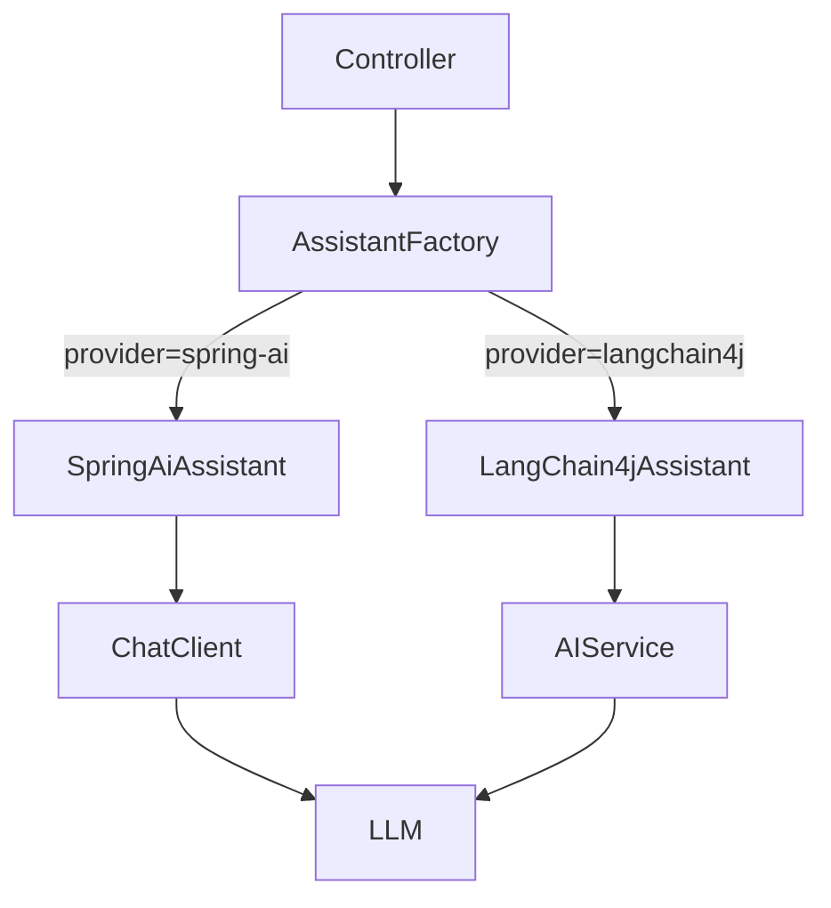

# 第 9 周:LangChain4j

## 本周目标
- 掌握 LangChain4j 核心抽象与 AI Service 注解式开发
- 与 Spring AI 对比,理解二者差异与适用场景
- 实现 LangChain4j 版的 RAG / Tool / Memory
- 学习 LangChain4j 在 Quarkus / 纯 Java 项目中的用法
- 完成一个能"二选一"使用 Spring AI 或 LangChain4j 的项目

## 前置准备
- [ ] 完成 Week 8
- [ ] 阅读 LangChain4j 官方文档:https://docs.langchain4j.dev/
- [ ] Maven/Gradle 已就绪

---

## Day 1 - LangChain4j 总览 + AI Service

**主题**:对照 Spring AI 学 LangChain4j 的差异点

### 上午(3h)理论学习
- [ ] LangChain4j 定位(1h)
  - 由社区主导,功能更全(更接近 Python LangChain)
  - 支持 Spring Boot / Quarkus / Helidon / 纯 Java
  - 当前版本(写计划时 0.36+ → 1.x)
- [ ] AI Service:声明式编程(2h) ⭐ 最大亮点
  - 用 `interface` 定义 AI 能力,框架自动实现
  - `@SystemMessage` / `@UserMessage` 注解
  - 输入参数自动拼接到 prompt
  - 返回类型自动反序列化(Java 对象 / List / Map)
  - **类比 Spring**:像 Spring Data JPA Repository
- [ ] Spring AI vs LangChain4j 对照
  | 维度 | Spring AI | LangChain4j |
  |------|-----------|-------------|
  | 设计哲学 | Spring 风格、ChatClient 流式 API | 声明式接口 AI Service |
  | 生态 | Spring Boot 优先 | 多框架 / 纯 Java |
  | 抽象层级 | 偏底层,Advisor 灵活 | 偏高层,开箱即用 |
  | 文档完整度 | 官方文档清晰 | 文档详细但分散 |
  | 推荐场景 | 已用 Spring,要细粒度控制 | 想快速产出,看重声明式 |

### 下午(3h)动手实践
- [ ] 新建 LangChain4j 项目(30min)
  - Maven 依赖:`langchain4j` + `langchain4j-open-ai`(或 dashscope)
  - 选 Spring Boot Starter:`langchain4j-spring-boot-starter`
- [ ] 第一个 AI Service(2.5h)
  ```java
  interface Assistant {
      @SystemMessage("你是一个友好的助手,用中文回答")
      String chat(@UserMessage String userMessage);

      @UserMessage("请帮我从下面文本中抽取关键词:{{it}}")
      List<String> extractKeywords(String text);

      Recipe generateRecipe(String dishName);
  }
  ```
  - 实现 3 个不同返回类型的方法(String / List / 自定义对象)
  - 提交到 `week09/day1/langchain4j-hello/`

### 晚上(2h)整理与提交
- [ ] 整理"Spring AI vs LangChain4j 选型笔记"
- [ ] commit & push
- [ ] 填写每日总结

### 今日交付物
- [ ] LangChain4j 第一个项目
- [ ] 对比笔记

### 推荐资源
- LangChain4j 官方文档:https://docs.langchain4j.dev/
- LangChain4j 示例:https://github.com/langchain4j/langchain4j-examples
- 入门教程:https://docs.langchain4j.dev/tutorials

---

## Day 2 - Tools + Memory + 流式

**主题**:LangChain4j 的工具调用、记忆、流式响应

### 上午(3h)理论学习
- [ ] Tools(1h)
  - `@Tool` 注解(与 Spring AI 极相似)
  - 多 Tool 注入:`.tools(tool1, tool2, ...)`
  - 异常处理与重试
- [ ] ChatMemory(1h)
  - `MessageWindowChatMemory`:固定窗口
  - `TokenWindowChatMemory`:按 token 限制
  - `ChatMemoryStore`:持久化(InMemory / Redis / 自定义)
  - 多用户多会话:`memoryId`
- [ ] 流式输出(1h)
  - `TokenStream` 返回类型
  - `onNext` / `onComplete` / `onError` 回调
  - 与 Spring WebFlux / SSE 集成

### 下午(3h)动手实践
- [ ] 接入 5 个 Tools(1h)
  - 复用 Week 8 的工具方法,改成 LangChain4j 风格
- [ ] 多会话 Memory(1h)
  - 实现 `chat(userId, message)` 接口
  - 不同用户独立会话
- [ ] 流式接口(1h)
  - 用 `TokenStream` 实现 SSE 接口

### 晚上(2h)整理与提交
- [ ] 整理"LangChain4j 三大特性速查"
- [ ] commit & push
- [ ] 填写每日总结

### 今日交付物
- [ ] LangChain4j Tools + Memory + Streaming 示例

### 推荐资源
- AI Service:https://docs.langchain4j.dev/tutorials/ai-services
- Tools:https://docs.langchain4j.dev/tutorials/tools

---

## Day 3 - LangChain4j RAG

**主题**:用 LangChain4j 构建 RAG

### 上午(3h)理论学习
- [ ] 核心组件(1.5h)
  - `Document` / `DocumentLoader` / `DocumentParser`
  - `DocumentSplitter`(支持递归、按段落、按句子等)
  - `EmbeddingModel`:多家厂商 + 本地 ONNX
  - `EmbeddingStore`:`InMemory` / `Chroma` / `Milvus` / `Pinecone` / `Qdrant` / `PgVector` / `Redis` / `Elasticsearch`
  - `ContentRetriever`:封装"检索器"
  - `RetrievalAugmentor`:RAG 增强器(类似 Spring AI Advisor)
- [ ] EasyRAG 一键启动(1.5h)
  - `EmbeddingStoreIngestor`:一行代码构建索引
  - 适合快速 demo

### 下午(3h)动手实践
- [ ] 用 LangChain4j EasyRAG 跑通(1h)
  - 用同一份 PDF
  - 一行代码构建索引、一行代码做 RAG
- [ ] 高级 RAG:混合检索 + Rerank(2h)
  - 自定义 `ContentRetriever`
  - 用 BGE-Reranker
  - 接入 Milvus
  - 提交到 `week09/day3/langchain4j-rag/`

### 晚上(2h)整理与提交
- [ ] 对比"Week 6 Python RAG"、"Week 8 Spring AI RAG"、"Week 9 LangChain4j RAG"三个版本的代码
- [ ] commit & push
- [ ] 填写每日总结

### 今日交付物
- [ ] LangChain4j RAG(简版 + 高级版)
- [ ] 三版 RAG 代码对照

### 推荐资源
- RAG:https://docs.langchain4j.dev/tutorials/rag
- EasyRAG:https://docs.langchain4j.dev/tutorials/rag#easy-rag

---

## Day 4 - 结构化输出 + JSON Schema + Guardrails

**主题**:让 Java 类型系统拥抱 LLM

### 上午(3h)理论学习
- [ ] 结构化输出(1.5h)
  - AI Service 自动支持自定义 POJO 返回
  - 嵌套对象、List、Map、Enum
  - 用 `@Description` 给字段加描述(自动加入 prompt)
  - 与 Pydantic + Instructor 对比
- [ ] JSON Mode / Structured Output(1h)
  - OpenAI Structured Outputs 在 LangChain4j 的使用
  - JSON Schema 自动生成
- [ ] Guardrails(护栏)(30min)
  - Input Guardrail:输入校验、注入检测
  - Output Guardrail:输出校验、二次修复

### 下午(3h)动手实践
- [ ] 复杂结构化输出(1.5h)
  - 定义 `Resume(name, contactInfo, List<Education> education, List<WorkExperience> experience, List<String> skills)`
  - 从一段简历文本抽取
  - 提交到 `week09/day4/resume-parser/`
- [ ] 实现 2 个 Guardrail(1.5h)
  - `PromptInjectionGuard`
  - `JsonSchemaGuard`:校验输出符合 schema,不符合则重试

### 晚上(2h)整理与提交
- [ ] 整理"LangChain4j 结构化输出技巧"
- [ ] commit & push
- [ ] 填写每日总结

### 今日交付物
- [ ] 复杂结构化输出示例
- [ ] 2 个 Guardrail

### 推荐资源
- Structured Output:https://docs.langchain4j.dev/tutorials/ai-services#return-types
- Guardrails:https://docs.langchain4j.dev/tutorials/guardrails

---

## Day 5 - 观测、评估、生产实践

**主题**:LangChain4j 应用的可观测性与质量保证

### 上午(3h)理论学习
- [ ] 观测(1.5h)
  - `ChatModelListener`:监听调用前后(类似 Spring Advisor)
  - 集成 LangFuse(支持 Java SDK 或直接 OTel)
  - 日志、指标、Trace 三件套
- [ ] 评估(1.5h)
  - 没有 Ragas 的 Java 等价物,可:
    - 用 LLM-as-Judge 自己写评估代码
    - 调用 Python Ragas 服务(HTTP)
  - 单元测试 AI Service:用 mock LLM
  - 回归测试:固定数据集 + 评估指标

### 下午(3h)动手实践
- [ ] 接入 LangFuse(1.5h)
  - 注册 LangFuse 账号或本地 docker 部署
  - 在 LangChain4j 中加 Listener,把 trace 推过去
  - 在 LangFuse 看到完整调用链
- [ ] 写 AI Service 单元测试(1.5h)
  - 用 Mockito mock `ChatLanguageModel`
  - 测试 prompt 拼接、参数传递、输出解析

### 晚上(2h)整理与提交
- [ ] 整理"LangChain4j 生产实践清单"
- [ ] commit & push
- [ ] 填写每日总结

### 今日交付物
- [ ] LangFuse 接入示例
- [ ] AI Service 单元测试代码

### 推荐资源
- Observability:https://docs.langchain4j.dev/tutorials/observability
- LangFuse:https://langfuse.com

---

## Day 6 - 本周综合项目:可切换 Spring AI / LangChain4j 的统一接口

**主题**:用工厂模式封装,让上层业务代码不感知底层框架

### 上午(3h)项目设计
- [ ] 需求
  - 上层业务:`IAiAssistant` 接口(`chat`、`rag`、`extract`)
  - 实现 A:基于 Spring AI
  - 实现 B:基于 LangChain4j
  - 通过配置 `ai.provider=spring-ai` 或 `ai.provider=langchain4j` 切换
  - 业务代码不改一行就能切换
- [ ] 工程结构(1h)
  ```
  ai-abstraction-demo/
  ├── pom.xml
  ├── src/main/java/com/example/
  │   ├── AiApp.java
  │   ├── core/
  │   │   ├── IAiAssistant.java      # 统一接口
  │   │   ├── ChatRequest.java
  │   │   └── ChatResponse.java
  │   ├── springai/
  │   │   ├── SpringAiAssistant.java
  │   │   └── SpringAiConfig.java
  │   ├── langchain4j/
  │   │   ├── LangChain4jAssistant.java
  │   │   └── LangChain4jConfig.java
  │   ├── factory/
  │   │   └── AssistantFactory.java
  │   └── controller/
  │       └── ChatController.java    # 调用统一接口
  └── src/main/resources/
      ├── application.yml
      └── application-springai.yml
      └── application-langchain4j.yml
  ```
- [ ] 设计抽象接口(2h)

### 下午(3h)动手实践
- [ ] 实现两套方案(2.5h)
- [ ] 验证切换效果(30min)

### 晚上(2h)收尾与提交
- [ ] 写一份对比文档:两套实现的代码量、性能、易用性
- [ ] commit & push
- [ ] 填写每日总结

### 今日交付物
- [ ] 双实现的抽象层项目
- [ ] 详尽对比文档

### 项目架构(Mermaid)



---

## Day 7 - 复盘 + 阶段性回顾

### 上午(3h)复盘
- [ ] 填写"本周复盘"
- [ ] 整理 Week 8-9 两周成果
- [ ] 自评:你现在能不能进一个 Java + AI 团队?

### 下午(3h)阶段性总结
- [ ] 把 Week 5-9 五周的项目整理成 GitHub 仓库
- [ ] 准备开始写第一份"AI 应用工程师"简历草稿
- [ ] 关注 1-2 个目标公司的 AI 岗位 JD
- [ ] 休息 ✅

### 晚上(2h)
- [ ] 预读 `week-10-model-deploy.md`
- [ ] 下载 Ollama:https://ollama.com
- [ ] (有 GPU)了解 WSL2 + CUDA(若用 Windows)

---

## 本周里程碑检查

- [ ] 能用 LangChain4j AI Service 写出声明式 LLM 接口
- [ ] 能用 LangChain4j 实现 Tools / Memory / Streaming
- [ ] 能用 LangChain4j 实现高级 RAG
- [ ] 能在 Spring AI 和 LangChain4j 之间做技术选型
- [ ] 有 1 个双实现对比项目

## 本周资源汇总

### 文档
- LangChain4j 官方文档(必读):https://docs.langchain4j.dev/
- 示例仓库:https://github.com/langchain4j/langchain4j-examples
- 通义千问 LangChain4j:https://help.aliyun.com/zh/dashscope/developer-reference/langchain4j

### 视频
- LangChain4j 官方 YouTube(英文)
- B 站搜"LangChain4j"

### 阅读
- 《Spring AI vs LangChain4j》对比博客(可自己写一篇)

---

## 本周复盘

### 完成度自评
- 整体完成度:____ / 7 天
- 学习时长统计:____ 小时
- GitHub commit 数:____

### 收获最大的三个点
1.
2.
3.

### Spring AI vs LangChain4j 选型结论
- 我倾向选:
- 原因:

### 最大的卡点
-

### 阶段性自评(Week 5-9 LLM 应用核心五周)
> 你现在已经具备 AI 应用工程师的核心能力,Week 10-11 补部署与运维,Week 12-14 做项目找工作。

- 自评分(1-10):____
- 已能独立完成:
- 还需要补:
