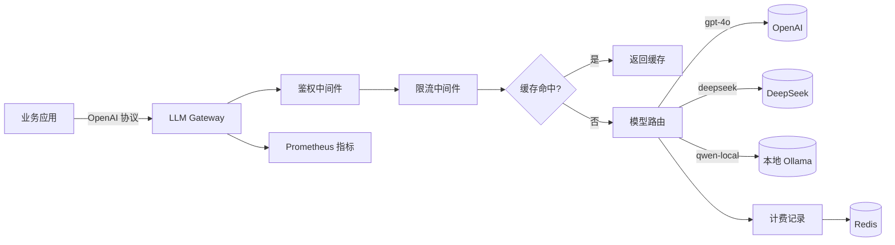

# 第 10 周:本地模型部署

## 本周目标
- 掌握主流本地 LLM 部署方案:Ollama / LM Studio / vLLM / llama.cpp
- 理解量化(GGUF / GPTQ / AWQ)与显存计算
- 用 FastAPI 把模型封装为 OpenAI 兼容 API
- 学会 Docker 容器化部署 LLM 服务
- 学会 GPU 推理优化基础

## 前置准备
- [ ] 完成 Week 1-9
- [ ] Docker Desktop 可用
- [ ] 下载 Ollama:https://ollama.com(Windows / Mac / Linux)
- [ ] (有 GPU)NVIDIA 驱动 + CUDA 12+
- [ ] 安装:`pip install fastapi uvicorn openai httpx`

---

## Day 1 - Ollama + LM Studio:5 分钟跑起本地模型

**主题**:零门槛本地模型,体会"本地化"价值

### 上午(3h)理论学习
- [ ] 为什么要本地部署(1h)
  - 数据隐私(企业敏感数据不出网)
  - 成本(高频调用比 API 便宜)
  - 离线可用
  - 自主可控(微调、定制)
- [ ] 模型格式与量化(2h)
  - HuggingFace 原生格式(`.safetensors`)
  - GGUF 格式(llama.cpp / Ollama 使用)
  - GPTQ / AWQ(GPU 量化)
  - 量化等级:Q2/Q4/Q5/Q8 vs FP16/BF16
  - **显存计算公式**:
    - FP16:模型参数 × 2 字节
    - Q4:模型参数 × 0.5 字节
    - 7B 模型 FP16 ≈ 14GB,Q4 ≈ 4GB

### 下午(3h)动手实践
- [ ] Ollama 实战(2h)
  - 安装 + 启动 Ollama
  - 命令行下载并运行 Qwen2.5:`ollama run qwen2.5:7b`
  - 测试 `ollama list`、`ollama pull`、`ollama rm`
  - 用 curl 调用 REST API:`http://localhost:11434/api/chat`
  - 用 OpenAI SDK 调用兼容接口:`http://localhost:11434/v1`
  - **重要**:Ollama 是 OpenAI API 兼容的!
  - 提交到 `week10/day1/ollama_demo.md`
- [ ] LM Studio 实战(1h)
  - 安装 LM Studio
  - 下载一个模型(如 Qwen2.5-7B-Instruct GGUF)
  - 启动本地 server,体验图形化管理

### 晚上(2h)整理与提交
- [ ] 整理"本地模型部署对比表"
- [ ] commit & push
- [ ] 填写每日总结

### 今日交付物
- [ ] Ollama 部署文档与调用示例
- [ ] LM Studio 截图

### 推荐资源
- Ollama:https://ollama.com
- Ollama 模型库:https://ollama.com/library
- LM Studio:https://lmstudio.ai

---

## Day 2 - llama.cpp + 量化深入

**主题**:理解 Ollama / LM Studio 底层是怎么跑的

### 上午(3h)理论学习
- [ ] llama.cpp 项目(1.5h)
      https://github.com/ggerganov/llama.cpp
  - C++ 实现的 LLM 推理引擎
  - 支持 CPU / GPU / Metal
  - GGUF 格式之父
  - 量化原理简介
- [ ] 模型转换与量化(1.5h)
  - 从 HF safetensors 转 GGUF:`convert_hf_to_gguf.py`
  - 量化:`./llama-quantize model.gguf model-q4.gguf Q4_K_M`
  - 不同量化等级的质量损失

### 下午(3h)动手实践
- [ ] 编译/下载 llama.cpp 二进制(1h)
  - Windows 可用 release 版本
- [ ] 用 llama.cpp 跑 GGUF 模型(1h)
  - 从 HuggingFace 下载一个 GGUF 模型
  - `./llama-cli -m model.gguf -p "你好"`
- [ ] 量化一个模型(1h,可选,需要时间和带宽)
  - 下载 Qwen2.5-1.5B safetensors
  - 转 GGUF
  - 量化为 Q4_K_M
  - 对比 Q4 与原版输出质量

### 晚上(2h)整理与提交
- [ ] 整理"量化等级选择指南"
- [ ] commit & push
- [ ] 填写每日总结

### 今日交付物
- [ ] llama.cpp 使用记录
- [ ] (可选)自己量化的 GGUF 模型

### 推荐资源
- llama.cpp:https://github.com/ggerganov/llama.cpp
- 量化原理:https://huggingface.co/docs/optimum/concept_guides/quantization

---

## Day 3 - vLLM:生产级推理服务

**主题**:高吞吐 GPU 推理引擎

### 上午(3h)理论学习
- [ ] vLLM 核心创新(1.5h)
      https://docs.vllm.ai/
  - PagedAttention:类比操作系统的分页内存
  - Continuous Batching:动态批处理
  - 为什么吞吐高 10x
- [ ] 部署形态(1.5h)
  - 单机单卡 / 单机多卡(Tensor Parallel)
  - 多机多卡(Pipeline Parallel)
  - OpenAI 兼容 API
  - 与 Ollama 的区别:vLLM 面向高并发生产

### 下午(3h)动手实践
- [ ] 安装 vLLM(1.5h)
  - **重要**:Windows 原生不支持,用 WSL2 或 Linux
  - 或用 Docker:`vllm/vllm-openai`
  - 需要 NVIDIA GPU + CUDA
  - **无 GPU 怎么办**:
    - 用 Modal / Replicate / RunPod 等云服务
    - 阿里云 PAI-DSW 临时算力
    - 跳过本动手部分,只看文档
- [ ] 启动 OpenAI 兼容服务(1.5h)
  ```bash
  python -m vllm.entrypoints.openai.api_server \
      --model Qwen/Qwen2.5-7B-Instruct \
      --port 8000
  ```
  - 用 OpenAI SDK 调用
  - 压测吞吐(`ab` 或 `locust`)

### 晚上(2h)整理与提交
- [ ] 整理"Ollama vs vLLM 选型"
- [ ] commit & push
- [ ] 填写每日总结

### 今日交付物
- [ ] vLLM 部署文档(或学习笔记)

### 推荐资源
- vLLM 文档:https://docs.vllm.ai/
- TGI(Hugging Face):https://github.com/huggingface/text-generation-inference

---

## Day 4 - FastAPI 封装 + OpenAI 兼容协议

**主题**:做一个"自己的 OpenAI"

### 上午(3h)理论学习
- [ ] OpenAI API 协议(1.5h)
  - `/v1/chat/completions` 请求/响应规范
  - 流式响应:SSE 格式 `data: {...}\n\n`
  - 错误响应规范
  - 模型列表:`/v1/models`
- [ ] FastAPI 基础(1.5h)
  - 路由、Pydantic 模型、依赖注入
  - 异步处理
  - `StreamingResponse`
  - **类比 Spring Boot**:几乎一一对应

### 下午(3h)动手实践
- [ ] 实现一个 OpenAI 兼容代理(3h)
  - 用 FastAPI 启动 HTTP 服务
  - 实现 `/v1/chat/completions` 接口(同步 + 流式)
  - 后端调用 transformers 本地加载的小模型(如 Qwen2.5-0.5B)
  - 或后端转发到 Ollama / vLLM
  - 加上 token 计数、日志、限流(用 `slowapi`)
  - 用 OpenAI SDK 测试可调用
  - 提交到 `week10/day4/openai-proxy/`

### 晚上(2h)整理与提交
- [ ] 整理"FastAPI 工程化模板"
- [ ] commit & push
- [ ] 填写每日总结

### 今日交付物
- [ ] OpenAI 兼容服务实现

### 推荐资源
- FastAPI 中文文档:https://fastapi.tiangolo.com/zh/
- OpenAI API 规范:https://platform.openai.com/docs/api-reference

---

## Day 5 - Docker 容器化部署 + GPU 容器

**主题**:把模型服务做成可一键部署的产物

### 上午(3h)理论学习
- [ ] Docker 复习(1h)
  - 你应该已经熟,跳过基础
  - 重点:多阶段构建(减小镜像)、`.dockerignore`
- [ ] GPU 容器(1.5h)
  - NVIDIA Container Toolkit 安装
  - `--gpus all` 参数
  - CUDA 镜像选择:`nvidia/cuda:12.4.0-runtime-ubuntu22.04`
- [ ] docker-compose 编排(30min)
  - 多服务编排:app + vLLM + Chroma + Redis

### 下午(3h)动手实践
- [ ] 给 Day 4 的 FastAPI 服务写 Dockerfile(1.5h)
  - 多阶段构建
  - `python:3.11-slim` 基础镜像
  - 推送到 Docker Hub 或本地 registry
- [ ] docker-compose 编排(1.5h)
  - 编排:fastapi-app + Chroma + Redis(用于限流缓存)
  - 一条命令启动所有服务
  - 提交到 `week10/day5/docker-compose-stack/`

### 晚上(2h)整理与提交
- [ ] 整理"AI 应用 Docker 化最佳实践"
- [ ] commit & push
- [ ] 填写每日总结

### 今日交付物
- [ ] Dockerfile + docker-compose.yml
- [ ] 镜像推送记录

### 推荐资源
- NVIDIA Container Toolkit:https://docs.nvidia.com/datacenter/cloud-native/container-toolkit/

---

## Day 6 - 本周综合项目:本地 LLM 网关服务

**主题**:整合 Ollama / vLLM / 第三方 API,做一个统一网关

### 上午(3h)需求与设计
- [ ] 需求
  - 统一对外暴露 OpenAI 兼容 API
  - 根据模型名路由到不同后端(本地 Ollama / 远程 OpenAI / DeepSeek / DashScope)
  - 鉴权(API key)
  - 限流(按用户)
  - 计费(记录每个 key 的消费)
  - 缓存(相同请求复用结果)
  - 日志与指标(Prometheus 暴露)
- [ ] 工程结构
  ```
  llm-gateway/
  ├── Dockerfile
  ├── docker-compose.yml
  ├── pyproject.toml
  ├── src/
  │   ├── main.py
  │   ├── routes/
  │   │   ├── chat.py
  │   │   ├── models.py
  │   │   └── admin.py
  │   ├── backends/
  │   │   ├── base.py
  │   │   ├── openai_backend.py
  │   │   ├── ollama_backend.py
  │   │   └── dashscope_backend.py
  │   ├── middleware/
  │   │   ├── auth.py
  │   │   ├── ratelimit.py
  │   │   ├── billing.py
  │   │   └── cache.py
  │   └── models/
  └── tests/
  ```

### 下午(3h)动手实践
- [ ] 实现核心模块(2.5h)
- [ ] 测试与部署(30min)

### 晚上(2h)收尾与提交
- [ ] 写 README + 架构图
- [ ] commit & push
- [ ] 填写每日总结

### 今日交付物
- [ ] LLM 网关服务
- [ ] 架构图

### 项目架构(Mermaid)



---

## Day 7 - 复盘 + 自由学习

### 上午(3h)复盘
- [ ] 填写"本周复盘"
- [ ] 自评里程碑

### 下午(3h)自由学习
- 选项 A:学习 Triton Inference Server(NVIDIA 生产级)
- 选项 B:把 LLM Gateway 部署到云服务器
- 选项 C:写博客《我搭建的本地 LLM Gateway》
- 选项 D:休息 ✅

### 晚上(2h)
- [ ] 预读 `week-11-mlops.md`
- [ ] 申请 LangFuse 账号或本地部署
- [ ] (有 GPU)安装 unsloth 或 LLaMA-Factory

---

## 本周里程碑检查

- [ ] 能用 Ollama 本地跑 7B 级模型并对外提供 API
- [ ] 理解 GGUF 格式与量化等级
- [ ] 能用 FastAPI 封装 OpenAI 兼容服务
- [ ] 能 Docker 化 LLM 应用并 docker-compose 编排
- [ ] 有 1 个 LLM 网关项目

## 本周资源汇总

### 工具
- Ollama:https://ollama.com
- LM Studio:https://lmstudio.ai
- vLLM:https://docs.vllm.ai
- llama.cpp:https://github.com/ggerganov/llama.cpp
- Triton:https://github.com/triton-inference-server/server

### 文档
- FastAPI:https://fastapi.tiangolo.com/zh/
- Docker:https://docs.docker.com

### 阅读
- vLLM 论文:https://arxiv.org/abs/2309.06180
- LLM 推理优化综述

---

## 本周复盘

### 完成度自评
- 整体完成度:____ / 7 天
- 学习时长统计:____ 小时
- GitHub commit 数:____

### 收获最大的三个点
1.
2.
3.

### 是否有 GPU 资源
- [ ] 本地 GPU 充足
- [ ] 用了云 GPU(费用 ____ 元)
- [ ] 无 GPU,主要用 Ollama CPU 跑

### 最大的卡点
-

### 下周(MLOps + 微调)需要重点关注
-
