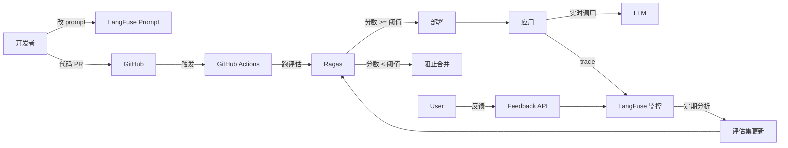

# 第 11 周:MLOps + LoRA 微调

## 本周目标
- 掌握 LLM 应用的可观测性:LangFuse / LangSmith
- 理解 Prompt 版本管理与 A/B 测试
- 完成至少 1 次 LoRA 微调实战(7B 级模型)
- 掌握 LLMOps 的核心实践:评估、监控、迭代
- 学会成本控制策略

## 前置准备
- [ ] 完成 Week 1-10
- [ ] LangFuse 账号(云端免费版)或本地 docker 部署
- [ ] (有 GPU)安装 unsloth:`pip install unsloth`
- [ ] (无 GPU)注册 Google Colab Pro 或租用云 GPU(autodl 等)

---

## Day 1 - LLM 可观测性:LangFuse 深入

**主题**:看见 LLM 应用的"黑盒"内部

### 上午(3h)理论学习
- [ ] 为什么需要 LLM 可观测性(1h)
  - 传统监控只看请求/响应/延迟
  - LLM 应用还需要看:prompt、token、模型版本、检索文档、工具调用链
  - 一个用户问题可能触发多次 LLM 调用 → 需要 Trace
- [ ] LangFuse 核心概念(2h)
  - Trace:一次完整请求
  - Span / Generation / Event:子操作
  - Score:质量评分(自动 + 人工)
  - Dataset:用于回归测试
  - Prompt Management:版本化 prompt
- [ ] LangSmith / Helicone / Phoenix 简介(可选)

### 下午(3h)动手实践
- [ ] 部署 LangFuse(1h)
  - 选项 1:用 cloud.langfuse.com(免费版)
  - 选项 2:docker-compose 本地部署
  - 创建项目,获取 API key
- [ ] 接入 Python 项目(1h)
  - 把 Week 6 RAG 项目接入 LangFuse
  - 用 `@observe` 装饰器
  - 在网页上查看完整 Trace
- [ ] 接入 Java 项目(1h)
  - 把 Week 8 Spring AI 项目接入 LangFuse
  - 用 ChatModel Listener 或 OpenTelemetry

### 晚上(2h)整理与提交
- [ ] 整理"LangFuse 接入指南"
- [ ] commit & push
- [ ] 填写每日总结

### 今日交付物
- [ ] LangFuse 接入示例(Python + Java)
- [ ] Trace 截图

### 推荐资源
- LangFuse 文档:https://langfuse.com/docs
- LangSmith:https://docs.smith.langchain.com/

---

## Day 2 - Prompt 版本管理 + A/B 测试

**主题**:工程化管理 Prompt

### 上午(3h)理论学习
- [ ] Prompt 工程化挑战(1h)
  - prompt 散落在代码里难维护
  - 修改 prompt 需要发版
  - 没法做 A/B 测试与回滚
- [ ] LangFuse Prompt Management(1.5h)
  - 在 LangFuse UI 创建 prompt
  - 代码中按名称拉取 + 缓存
  - 版本号、标签(production / staging)
  - 灰度发布:按用户 ID hash 分流
- [ ] Prompt CI/CD(30min)
  - prompt 变更触发评估流水线
  - 评估通过后自动上线

### 下午(3h)动手实践
- [ ] 把 RAG 项目的 prompt 迁移到 LangFuse(1.5h)
  - 代码从 LangFuse 拉取 prompt
  - 体验:不发版改 prompt
- [ ] 实现一个简单 A/B 测试(1.5h)
  - 准备 prompt A 和 prompt B
  - 按用户 ID 50/50 分流
  - 记录每个版本的回答质量评分(LLM-as-Judge)
  - 在 LangFuse 比较两版

### 晚上(2h)整理与提交
- [ ] 整理"Prompt 工程化清单"
- [ ] commit & push
- [ ] 填写每日总结

### 今日交付物
- [ ] LangFuse Prompt 管理示例
- [ ] A/B 测试代码

### 推荐资源
- Prompt Management:https://langfuse.com/docs/prompts

---

## Day 3 - LLM 评估:Ragas + LLM-as-Judge

**主题**:让 LLM 应用质量可量化

### 上午(3h)理论学习
- [ ] 评估维度(1.5h)
  - **检索质量**:Recall@K、MRR、Hit Rate
  - **生成质量**:Faithfulness、Answer Relevance、Context Precision
  - **业务质量**:正确率、用户满意度
  - **安全质量**:有害内容、隐私泄露
- [ ] 评估方法(1.5h)
  - **人工标注**:金标准,贵
  - **传统指标**:BLEU / ROUGE(对 LLM 已经过时)
  - **LLM-as-Judge**:用强模型评估弱模型
  - **Ragas**:开源 RAG 评估框架
  - **专门模型**:Prometheus、Auto-J(评估专用 LLM)

### 下午(3h)动手实践
- [ ] 构建评估数据集(1.5h)
  - 用 Ragas 的 `TestsetGenerator` 从你的文档自动生成 50 个测试问题
  - 人工 review,确保问题质量
- [ ] 跑 Ragas 完整评估(1.5h)
  - 评估 Faithfulness、Answer Relevance、Context Precision、Context Recall
  - 把每条结果写回 LangFuse 作为 score
  - 提交到 `week11/day3/ragas_eval/`

### 晚上(2h)整理与提交
- [ ] 整理"LLM 评估实施清单"
- [ ] commit & push
- [ ] 填写每日总结

### 今日交付物
- [ ] 50 题评估数据集
- [ ] Ragas 评估报告

### 推荐资源
- Ragas 文档:https://docs.ragas.io
- Prometheus:https://github.com/prometheus-eval/prometheus-eval

---

## Day 4 - LoRA 微调原理 + 准备数据

**主题**:理解低成本微调

### 上午(3h)理论学习
- [ ] 微调范式(1h)
  - 全参数微调(Full Fine-tuning):贵
  - **LoRA**:低秩适配,只训练少量参数
  - **QLoRA**:量化 + LoRA,在消费级显卡跑 7B 微调
  - **DPO / ORPO**:偏好对齐(替代 RLHF)
- [ ] LoRA 原理(1.5h)
  - 把原矩阵 W 冻结,引入低秩矩阵 A·B 学习"增量"
  - 关键超参:`r`(秩)、`alpha`、`target_modules`
  - 通常只训练参数的 0.1%~1%
- [ ] 微调数据准备(30min)
  - 格式:Alpaca / ShareGPT / OpenAI ChatML
  - 数量:1000~10000 条够用
  - 质量 > 数量

### 下午(3h)动手实践
- [ ] 准备微调数据(2h)
  - 选定一个具体任务,例如:
    - 客服话术:把通用回答改成你公司的语气
    - 代码生成:特定 SDK / 内部 API 风格
    - 信息抽取:特定字段格式
  - 用 LLM 生成 + 人工 review,造 200-500 条
  - 格式化为 Alpaca/ShareGPT JSON
  - 提交到 `week11/day4/dataset/`
- [ ] 学习 unsloth 或 LLaMA-Factory(1h)
  - 选 1 个工具熟悉 UI 或 CLI

### 晚上(2h)整理与提交
- [ ] 整理"微调任务设计文档"
- [ ] commit & push
- [ ] 填写每日总结

### 今日交付物
- [ ] 200-500 条微调数据
- [ ] 任务设计文档

### 推荐资源
- LoRA 论文:https://arxiv.org/abs/2106.09685
- QLoRA 论文:https://arxiv.org/abs/2305.14314
- Unsloth:https://github.com/unslothai/unsloth
- LLaMA-Factory:https://github.com/hiyouga/LLaMA-Factory

---

## Day 5 - LoRA 实战微调

**主题**:跑通一次完整微调

### 上午(3h)训练
- [ ] 用 Unsloth(推荐,显存友好,速度快 2x)(2h)
  - 选择基座:`Qwen/Qwen2.5-1.5B-Instruct` 或 `Qwen/Qwen2.5-7B-Instruct`
  - 配置 LoRA 参数:`r=16, alpha=32`
  - 训练 3-5 epoch
  - 1.5B 模型在消费级 GPU(8-12GB)能跑
  - 7B 需 16GB+,或用 Colab T4 / 阿里云 PAI
- [ ] (无 GPU 备选)在 Colab 跑(1h)
  - 用免费 T4 GPU
  - 用 unsloth 官方 notebook 模板
  - 提交到 `week11/day5/finetune_notebook.ipynb`

### 下午(3h)合并与测试
- [ ] 合并 LoRA 权重(1h)
  - 导出为完整模型(safetensors)
  - 或保留 LoRA adapter 单独加载
- [ ] 转换为 GGUF + 量化(1h)
  - `convert_hf_to_gguf.py`
  - 量化为 Q4_K_M
- [ ] 用 Ollama 部署微调后模型(1h)
  - 创建 Modelfile
  - `ollama create my-model -f Modelfile`
  - 用 Ollama API 调用

### 晚上(2h)对比测试
- [ ] 准备 20 个测试问题(1h)
  - 微调前 vs 微调后,看看是否学到了目标风格/格式
  - 记录质量提升
- [ ] commit & push,填写每日总结(1h)

### 今日交付物
- [ ] 微调好的模型(GGUF 文件)
- [ ] Ollama 可调用
- [ ] 微调前后对比报告

### 推荐资源
- Unsloth 教程:https://docs.unsloth.ai/
- Unsloth Notebooks:https://github.com/unslothai/unsloth#-finetune-for-free

---

## Day 6 - 本周综合项目:MLOps 闭环

**主题**:把"开发-评估-上线-监控-迭代"串成闭环

### 上午(3h)需求与设计
- [ ] 选定上线场景:Week 5-10 任一项目
  - 推荐:RAG 问答系统(Week 6 或 Week 8 项目)
- [ ] MLOps 流程设计
  1. **开发**:在 LangFuse 管理 prompt
  2. **评估**:Ragas 跑评估集,分数达标才允许上线
  3. **上线**:CI/CD(GitHub Actions)
  4. **监控**:LangFuse 实时看 trace、token、延迟、错误
  5. **反馈**:用户点赞/点踩 → 写回 LangFuse score
  6. **迭代**:差案例 → 加入评估集 → 改 prompt / 微调

### 下午(3h)动手实践
- [ ] 实现核心闭环(2.5h)
  - prompt 从 LangFuse 拉取
  - 调用全程 trace 到 LangFuse
  - 用户反馈接口(`/feedback`)
  - 定时任务:跑评估集,达不到阈值告警
- [ ] 用 GitHub Actions 写一个评估 workflow(30min)
  - PR 触发评估
  - 分数低于阈值阻止合并

### 晚上(2h)收尾与提交
- [ ] 写 README + 架构图
- [ ] commit & push
- [ ] 填写每日总结

### 今日交付物
- [ ] MLOps 闭环系统
- [ ] GitHub Actions workflow

### 项目架构(Mermaid)

---

## Day 7 - 复盘 + 阶段性总结

### 上午(3h)复盘
- [ ] 填写"本周复盘"
- [ ] 整理 Week 10-11 部署运维成果
- [ ] 自评里程碑

### 下午(3h)阶段性总结
- [ ] **重要**:这是项目周(Week 12-14)前的最后一个学习周
- [ ] 把 Week 1-11 全部代码整理到 GitHub
- [ ] 选定 Week 12-14 三个项目的具体题目与目标
- [ ] 写一份"求职准备 checklist"

### 晚上(2h)
- [ ] 预读 `week-12-project-rag.md`
- [ ] 开始关注招聘信息(BOSS / 拉勾 / 牛客)
- [ ] 列出 5-10 个目标公司

---

## 本周里程碑检查

- [ ] 能接入 LangFuse 并看到完整 trace
- [ ] 能用 LangFuse 管理 prompt 版本
- [ ] 能用 Ragas 跑出 RAG 评估报告
- [ ] 完成至少 1 次 LoRA 微调并部署
- [ ] 有 1 个 MLOps 闭环示例

## 本周资源汇总

### 工具
- LangFuse:https://langfuse.com
- LangSmith:https://smith.langchain.com
- Ragas:https://docs.ragas.io
- Unsloth:https://github.com/unslothai/unsloth
- LLaMA-Factory:https://github.com/hiyouga/LLaMA-Factory
- MLflow:https://mlflow.org

### 论文
- LoRA:https://arxiv.org/abs/2106.09685
- QLoRA:https://arxiv.org/abs/2305.14314
- DPO:https://arxiv.org/abs/2305.18290

### 阅读
- 《LLMOps:大模型应用工程化实践》
- LangFuse Blog:https://langfuse.com/blog

---

## 本周复盘

### 完成度自评
- 整体完成度:____ / 7 天
- 学习时长统计:____ 小时
- GitHub commit 数:____
- 微调成功 / 失败:____

### 收获最大的三个点
1.
2.
3.

### LLMOps 关键认知
- 可观测性最关键:
- 评估最关键:
- 迭代最关键:

### 最大的卡点
-

### 学习阶段(Week 1-11)收官自评
> 11 周学习阶段结束,你已经具备:
> - Python / PyTorch / Transformers 基础
> - LLM API / Prompt / RAG / Agent 应用能力
> - Spring AI / LangChain4j Java 集成能力
> - 模型部署与 MLOps 能力

- 整体完成度自评(1-10):____
- 自我最满意的能力:
- 仍需要加强的能力:
- 下周(项目周)开始,目标:做出 3 个能写进简历的项目
