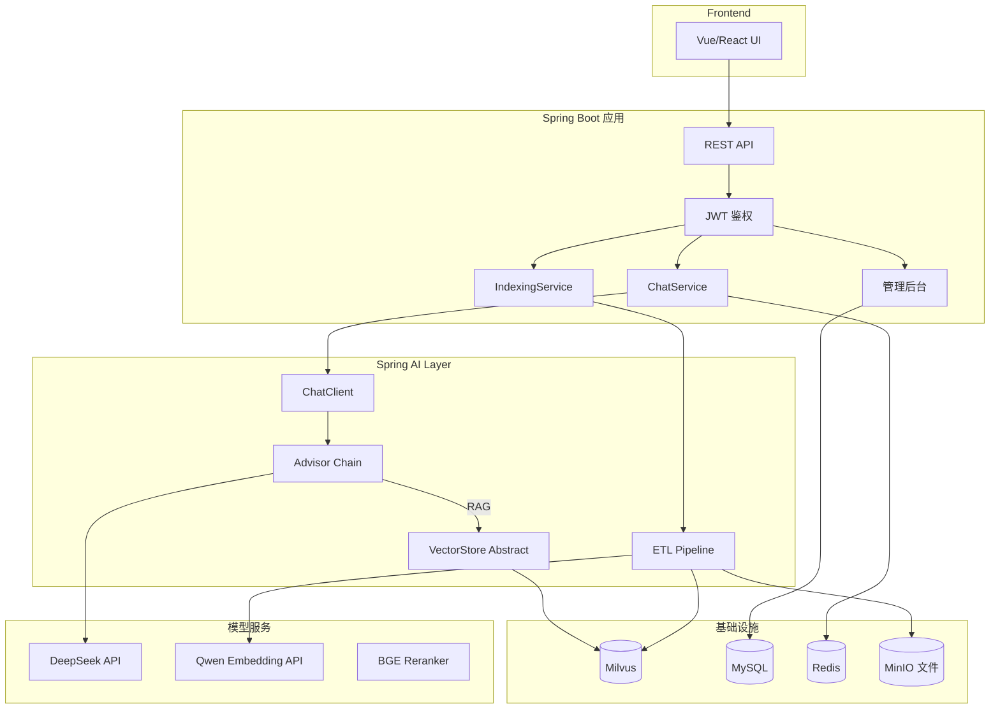

# 第 12 周:项目一 —— 企业知识库 RAG 系统

## 项目定位
- **简历核心项目 #1**:体现 Java 工程化 + AI 应用结合能力
- **目标技术栈**:Spring Boot 3 + Spring AI + Milvus + Qwen / DeepSeek + Vue/React 前端(可选)
- **预计代码量**:3000-5000 行 Java(含测试)
- **可演示场景**:模拟企业内部知识助手,文档上传 → 问答 → 引用来源

## 本周目标
- 完成一个生产质量的 RAG 系统
- 完整 README + 架构图 + 部署文档
- 至少 1 篇技术博客
- 部署到云服务器或可演示环境

## 前置准备
- [ ] 完成 Week 1-11
- [ ] GitHub 新建独立仓库 `enterprise-rag-system`
- [ ] 准备文档数据集(法律法规 / 公司 wiki / 技术文档 PDF,30-100 份)
- [ ] 服务器(可选,1 核 2G 即可,只跑 Web,LLM 用 API)

---

## 项目最终架构



---

## Day 1 - 项目设计 + 工程搭建

**主题**:把零散学到的能力组织成一个可演示的系统

### 上午(3h)需求分析与设计
- [ ] 用户故事(1h)
  - 普通用户:登录 → 问问题 → 看到答案与引用来源 → 评分反馈
  - 管理员:上传文档 → 查看索引状态 → 监控调用量与质量
- [ ] 系统设计(2h)
  - 模块拆分
  - 数据库表设计:`user` / `document` / `conversation` / `message` / `feedback` / `cost_log`
  - API 设计(REST + SSE 流式)
  - 鉴权方案:JWT
  - 关键技术决策:
    - 向量库:**Milvus**(生产级)
    - Embedding:**Qwen text-embedding-v3**(国内可用)
    - LLM:**DeepSeek**(性价比) + 通义千问(备份)
    - Rerank:**BGE-Reranker** 本地或 Jina API
    - 框架:Spring AI

### 下午(3h)工程搭建
- [ ] 用 Spring Initializr 创建项目(30min)
  - JDK 21,Maven
  - 依赖:Web、Security、JPA、MySQL、Redis、Spring AI(OpenAI/DashScope)、Validation
- [ ] 工程结构(2h)
  ```
  enterprise-rag-system/
  ├── pom.xml
  ├── docker-compose.yml         # Milvus + MySQL + Redis + MinIO
  ├── docs/                      # 项目文档与架构图
  ├── README.md
  ├── src/main/java/com/example/rag/
  │   ├── RagApplication.java
  │   ├── common/                # 通用工具、异常
  │   ├── config/                # Spring 配置
  │   │   ├── SecurityConfig.java
  │   │   ├── AiConfig.java      # ChatClient / VectorStore Bean
  │   │   └── RedisConfig.java
  │   ├── controller/
  │   │   ├── AuthController.java
  │   │   ├── ChatController.java
  │   │   ├── DocumentController.java
  │   │   └── AdminController.java
  │   ├── service/
  │   │   ├── ChatService.java
  │   │   ├── IndexingService.java
  │   │   ├── UserService.java
  │   │   └── FeedbackService.java
  │   ├── ai/
  │   │   ├── advisor/           # 自定义 Advisor
  │   │   │   ├── SecurityAdvisor.java
  │   │   │   ├── CostTrackingAdvisor.java
  │   │   │   └── CitationAdvisor.java
  │   │   ├── etl/               # 索引流水线
  │   │   │   ├── DocumentReader.java
  │   │   │   ├── Splitter.java
  │   │   │   └── Indexer.java
  │   │   └── retrieval/
  │   │       ├── HybridRetriever.java
  │   │       └── RerankPostProcessor.java
  │   ├── entity/                # JPA 实体
  │   ├── repository/            # JPA Repository
  │   ├── dto/
  │   └── exception/
  └── src/main/resources/
      ├── application.yml
      ├── application-dev.yml
      ├── application-prod.yml
      └── db/migration/          # Flyway SQL 脚本
  ```
- [ ] 启动基础设施 docker-compose(30min)

### 晚上(2h)
- [ ] 提交项目骨架
- [ ] commit & push
- [ ] 写初始 README
- [ ] 填写每日总结

### 今日交付物
- [ ] GitHub 仓库已创建,项目骨架可启动
- [ ] docker-compose 启动 Milvus / MySQL / Redis / MinIO
- [ ] 数据库表 SQL 脚本

---

## Day 2 - 文档管理 + 索引流水线

**主题**:实现"上传 → 索引"的完整能力

### 上午(3h)实现
- [ ] 文档上传接口(1.5h)
  - `POST /api/documents`:接收 multipart 上传
  - 文件存到 MinIO
  - 记录到 MySQL `document` 表(状态:UPLOADED)
  - 用消息队列或线程池异步触发索引(简单起见用 `@Async`)
- [ ] DocumentReader 实现(1.5h)
  - PDF:`PagePdfDocumentReader`(Spring AI 内置)
  - Word:用 Apache Tika
  - Markdown:`MarkdownDocumentReader`
  - HTML:Jsoup
  - 抽取元数据:文件名、页码、章节

### 下午(3h)实现
- [ ] 切分策略(1.5h)
  - 默认 `TokenTextSplitter`(chunk_size=512, overlap=50)
  - Markdown 走标题感知切分
  - 保留元数据(文件名、页码)
- [ ] Indexer 实现(1.5h)
  - 调用 Embedding API
  - 写入 Milvus
  - 更新 MySQL `document` 状态(INDEXED)
  - 失败重试
  - 进度追踪

### 晚上(2h)
- [ ] 上传 5 份测试文档,跑通完整流程
- [ ] commit & push
- [ ] 填写每日总结

### 今日交付物
- [ ] 文档上传 + 索引完整链路
- [ ] 索引进度可在数据库查到

---

## Day 3 - 检索 + RAG 核心链路

**主题**:实现"问 → 检索 → 生成"

### 上午(3h)实现
- [ ] HybridRetriever 实现(2h)
  - 向量检索(Milvus):Top 20
  - BM25 检索(可用 Lucene / Elasticsearch / 简单实现):Top 20
  - RRF 融合
- [ ] RerankPostProcessor(1h)
  - 调用 BGE-Reranker(可本地起 Python 服务 / 用 Jina API)
  - 重排取 Top 5

### 下午(3h)实现
- [ ] ChatService.chat() 主流程(1.5h)
  - 接收 user message
  - 调用 HybridRetriever 拿 Top 5 文档
  - 构建 Spring AI Prompt(System + User + Context)
  - 调用 ChatClient 流式输出
- [ ] CitationAdvisor 实现(1.5h)
  - 在 prompt 中要求 LLM 输出 `[1][2]` 引用标记
  - 响应后处理:把 `[N]` 替换为可点击的来源
  - 来源信息(文件名、页码、片段)单独返回

### 晚上(2h)
- [ ] 跑通端到端 RAG 流程
- [ ] commit & push
- [ ] 填写每日总结

### 今日交付物
- [ ] 完整 RAG 流程可调用
- [ ] 带引用来源的回答

---

## Day 4 - 用户体系 + 对话历史 + 流式 API

**主题**:让系统真正"可用"

### 上午(3h)实现
- [ ] 用户体系(1.5h)
  - 注册 / 登录接口
  - JWT 生成与校验
  - Spring Security 配置
- [ ] 对话历史(1.5h)
  - `conversation` 表:用户的多个会话
  - `message` 表:每会话的所有消息
  - Spring AI `JdbcChatMemory` 集成
  - 用户切换会话时加载历史

### 下午(3h)实现
- [ ] 流式 API(1.5h)
  - `POST /api/chat/stream` 返回 `Flux<ServerSentEvent>`
  - 流式同时把完整答案写入 message 表
- [ ] 用户反馈接口(1h)
  - `POST /api/messages/{id}/feedback`:点赞 / 点踩 / 评论
  - 写入 `feedback` 表
- [ ] 简单的多租户隔离(30min)
  - 检索时按用户/组织过滤元数据

### 晚上(2h)
- [ ] commit & push
- [ ] 填写每日总结

### 今日交付物
- [ ] 完整用户系统
- [ ] 流式对话 API

---

## Day 5 - 可观测性 + 管理后台 + 安全

**主题**:生产化必备

### 上午(3h)实现
- [ ] LangFuse 集成(1.5h)
  - 自定义 ChatModel Listener
  - 把所有调用 trace 推送
- [ ] 自定义 Advisor 链(1.5h)
  - `SecurityAdvisor`:输入注入检测、敏感词过滤
  - `CostTrackingAdvisor`:记录每次调用的 token 与成本到 `cost_log` 表
  - `RateLimitAdvisor`:基于 Redis 的限流

### 下午(3h)实现
- [ ] 管理后台 API(2h)
  - 文档管理:列表、删除、重新索引
  - 用户管理:列表、禁用
  - 统计接口:今日调用量、Top 用户、平均延迟、成本
  - 反馈分析:点踩消息列表(用于优化)
- [ ] 接入 Prometheus + Grafana(1h,可选)

### 晚上(2h)
- [ ] commit & push
- [ ] 填写每日总结

### 今日交付物
- [ ] 完整可观测性
- [ ] 管理后台 API

---

## Day 6 - 前端 + 部署 + 文档

**主题**:做出可演示的完整作品

### 上午(3h)前端(选一个方案)
**方案 A:Vue 3 + Element Plus**(推荐 Java 工程师)
**方案 B:React + Ant Design**
**方案 C:Spring Boot + Thymeleaf**(最简单)
**方案 D:用 Vercel v0 / Cursor 生成**

- [ ] 实现 4 个核心页面
  - 登录页
  - 对话页(流式输出 + 引用气泡)
  - 文档管理页(上传 + 列表)
  - 管理后台页(数据看板)

### 下午(3h)部署
- [ ] 准备生产 docker-compose(1h)
  - 应用 jar + Milvus + MySQL + Redis + Minio + Nginx
- [ ] 部署到云服务器(2h)
  - 阿里云 / 腾讯云 / 自有 VPS
  - 域名 + HTTPS(Let's Encrypt 免费证书)
  - 配置反向代理
  - 预先准备 demo 账号与数据

### 晚上(2h)文档
- [ ] 完善 README(必须包含):
  - 项目背景与目标
  - 技术栈
  - 架构图(Mermaid)
  - 核心功能演示(GIF / 截图)
  - 快速开始
  - 部署指南
  - 性能数据(召回率 / 延迟 / 成本)
- [ ] commit & push

### 今日交付物
- [ ] 前端 + 后端完整可演示
- [ ] 部署完毕,有公网访问地址
- [ ] 完整 README

---

## Day 7 - 技术博客 + 复盘

### 上午(3h)写博客
- [ ] **博客 1**:《从零搭建企业级 RAG 系统:Spring AI 实战》
  - 发布到掘金 / CSDN / 公众号 / 自建博客
  - 4000-6000 字
  - 必含:架构图、核心代码片段、性能数据、踩坑记录
- [ ] (可选)博客 2:某个技术点深入,如《混合检索 + RRF 在 Spring AI 中的实现》

### 下午(3h)复盘
- [ ] 填写"本周复盘"
- [ ] 整理项目的"项目亮点"列表(写简历用)
- [ ] 录制 1-2 分钟演示视频(选用,加分项)
- [ ] 准备项目讲解话术(面试用,3 分钟版本)

### 晚上(2h)准备下周
- [ ] 预读 `week-13-project-agent.md`
- [ ] 申请 GitHub PAT(Personal Access Token,Week 13 项目用)

---

## 项目亮点(写简历用)

完成后,你可以这样描述这个项目:

> **企业级 RAG 知识库系统** | Java、Spring AI、Milvus、DeepSeek
> - 基于 Spring AI 1.x 与 Milvus 构建,支持 PDF/Word/Markdown 多格式文档索引
> - 实现混合检索(向量 + BM25 + RRF 融合)+ BGE Reranker 二阶段精排,准确率较单向量检索提升 30%
> - 自定义 Spring AI Advisor 链:输入注入检测、Token 成本追踪、引用来源标注
> - 集成 LangFuse 全链路 trace,支持 Prompt 版本管理与 A/B 测试
> - 完整工程化:JWT 鉴权、多租户隔离、Redis 限流、Prometheus 指标
> - 部署:Docker Compose + Nginx,公网可演示
> - 仓库:github.com/xxx/enterprise-rag-system  线上:https://xxx.com

---

## 本周里程碑检查

- [ ] 项目已完整跑通端到端流程
- [ ] 部署到公网可演示
- [ ] GitHub 仓库 README 完整
- [ ] 至少 1 篇技术博客发布
- [ ] 准备好简历描述与面试讲解话术

## 本周复盘

### 完成度自评
- 整体完成度:____ / 7 天
- 学习时长统计:____ 小时
- GitHub commit 数:____
- 代码行数:____

### 项目质量自评
- 功能完整度:1-10 分:____
- 代码质量:1-10 分:____
- 工程化水平:1-10 分:____
- 文档完整度:1-10 分:____

### 项目亮点(自己提炼 3 条)
1.
2.
3.

### 项目踩坑(用于面试讲解)
1.
2.
3.

### 博客链接
-

### 下周(Agent 项目)需要复用本周哪些经验
-
