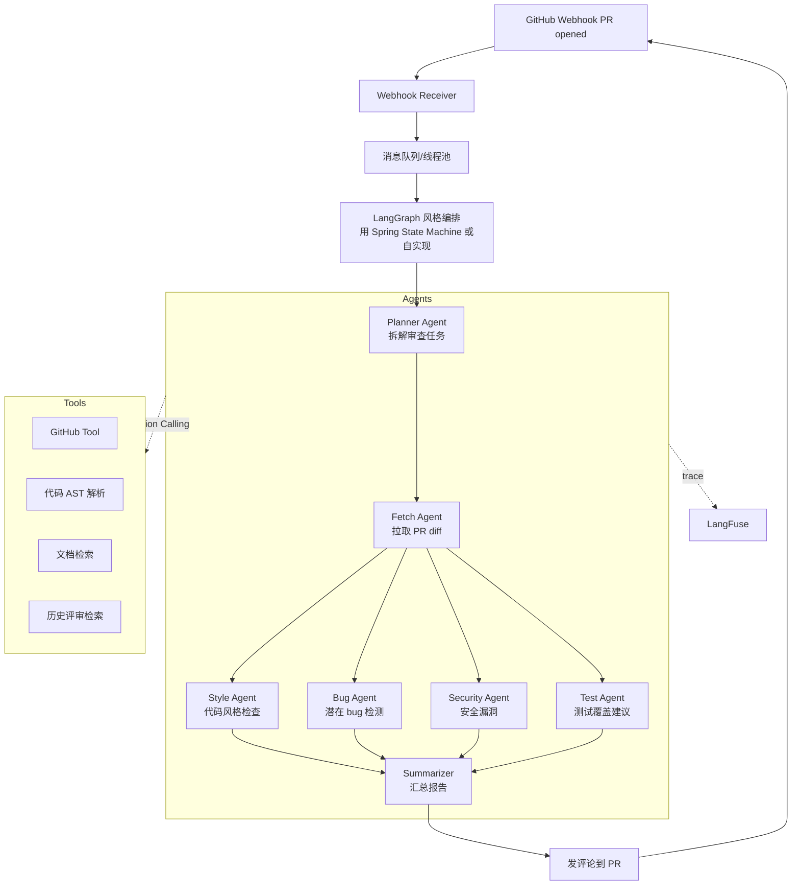

# 第 13 周:项目二 —— Agent 代码审查助手

## 项目定位
- **简历核心项目 #2**:体现 Agent 设计、Function Calling、LangGraph / LangChain4j 高级能力
- **目标技术栈**:Python(LangGraph / LangChain) **或** Java(LangChain4j + Spring Boot)二选一,推荐 Java
- **可演示场景**:GitHub PR 提交 → Agent 自动审查 → 输出评审报告 + 建议

## 本周目标
- 完成一个能"自主多步骤工作"的 Agent 系统
- 接入真实 GitHub API,做出可用的 Webhook 服务
- 多 Agent 协作 + 工具调用 + 记忆 + 评估
- 完整 README + 架构图 + 1 篇博客

## 前置准备
- [ ] 完成 Week 12
- [ ] GitHub 新建独立仓库 `agent-code-reviewer`
- [ ] 注册一个 GitHub 测试 organization 或仓库
- [ ] GitHub Personal Access Token(权限:repo、pull_requests)
- [ ] (选 Python 路线)安装 LangGraph 已就绪;(选 Java 路线)LangChain4j 已就绪

---

## 路线选择(Day 1 上午决定)

| 维度 | Python(LangGraph) | Java(LangChain4j + Spring) |
|------|-------------------|--------------------------|
| 优势 | LangGraph 生态成熟、文档全 | 与项目一技术栈呼应、更稀缺 |
| 学习曲线 | 已学过 | 已学过 |
| 简历卖点 | "用主流工具" | "Java + Agent 复合" |
| 推荐 | 二选一 | ⭐ 推荐(差异化) |

下面的每日清单以 **Java 路线** 为主,Python 路线在每天附简短对照。

---

## 项目最终架构(Java 路线)



---

## Day 1 - 需求设计 + 工程搭建

### 上午(3h)需求与设计
- [ ] 决定路线:Java(LangChain4j)还是 Python(LangGraph)
- [ ] 用户故事
  - 开发者:创建 PR → 自动收到 Bot 评审 → 查看建议 → 修改 → 再评审
  - 管理员:配置审查规则 / 关闭某仓库 / 看统计
- [ ] 核心审查维度
  - 代码风格(命名、缩进、注释)
  - 潜在 bug(空指针、资源未关闭、死循环)
  - 安全问题(SQL 注入、硬编码 secret)
  - 测试覆盖建议
  - 架构建议(可选)
- [ ] Multi-Agent 设计
  - 每个维度一个 Agent,有自己的 system prompt 和工具
  - Supervisor 编排,最后由 Summarizer 汇总

### 下午(3h)工程搭建
- [ ] Java 路线工程结构
  ```
  agent-code-reviewer/
  ├── pom.xml
  ├── docker-compose.yml
  ├── README.md
  ├── docs/
  ├── src/main/java/com/example/reviewer/
  │   ├── ReviewerApplication.java
  │   ├── controller/
  │   │   ├── WebhookController.java
  │   │   └── AdminController.java
  │   ├── agent/
  │   │   ├── core/
  │   │   │   ├── Agent.java          # 接口
  │   │   │   ├── AgentState.java     # 共享状态
  │   │   │   └── Orchestrator.java   # 编排器
  │   │   ├── planner/PlannerAgent.java
  │   │   ├── fetch/FetchAgent.java
  │   │   ├── style/StyleAgent.java
  │   │   ├── bug/BugAgent.java
  │   │   ├── security/SecurityAgent.java
  │   │   ├── test/TestAgent.java
  │   │   └── summary/SummarizerAgent.java
  │   ├── tools/
  │   │   ├── GitHubTool.java
  │   │   ├── AstTool.java            # 用 JavaParser
  │   │   ├── SearchTool.java         # Tavily
  │   │   └── HistoryTool.java        # 历史评审检索
  │   ├── config/
  │   ├── entity/
  │   ├── repository/
  │   └── service/
  └── src/main/resources/
      ├── application.yml
      └── prompts/                    # 每个 Agent 的 prompt
  ```
- [ ] 启动 docker-compose(Postgres + Redis)

### 晚上(2h)
- [ ] 提交骨架
- [ ] 写初始 README
- [ ] 填写每日总结

### 今日交付物
- [ ] 仓库骨架可启动
- [ ] 设计文档

---

## Day 2 - GitHub Webhook + 工具实现

### 上午(3h)实现
- [ ] GitHub Webhook 接收(1.5h)
  - 暴露 `/webhook/github` 接口
  - 校验 X-Hub-Signature
  - 解析 `pull_request.opened` / `synchronize` 事件
  - 用 ngrok 暴露本地端口测试
- [ ] GitHubTool 实现(1.5h)
  - 用 GitHub REST API(或 Kohsuke github-api 库)
  - 工具方法:
    - `getPullRequestDiff(owner, repo, prNumber)`
    - `getFileContent(owner, repo, path, ref)`
    - `postComment(owner, repo, prNumber, body)`
    - `postReviewComment(owner, repo, prNumber, path, line, body)`(行级评论)

### 下午(3h)实现
- [ ] AST 工具(1.5h)
  - 用 JavaParser 解析 Java 代码
  - 提取:类名、方法名、行号、复杂度、未关闭资源
  - 包装为 `@Tool` 方法
- [ ] HistoryTool(向量库)(1.5h)
  - 把项目过往优秀 PR 评论存入向量库(Chroma / Milvus)
  - 工具方法:`findSimilarReviewHistory(codeSnippet) -> List<PastReview>`
  - 为 Agent 提供"参考案例"

### 晚上(2h)
- [ ] commit & push
- [ ] 填写每日总结

### 今日交付物
- [ ] Webhook 能接收并校验
- [ ] 4 个核心工具实现完成

---

## Day 3 - 单个审查 Agent 实现

### 上午(3h)实现
- [ ] 用 LangChain4j AI Service 定义 Agent 接口(1h)
  ```java
  interface StyleAgent {
      @SystemMessage(fromResource = "prompts/style_agent.txt")
      StyleReviewResult review(@UserMessage String diff);
  }
  ```
- [ ] 每个 Agent 的 prompt 模板(2h)
  - `style_agent.txt`:代码风格审查指令
  - `bug_agent.txt`:bug 检测指令(含示例)
  - `security_agent.txt`:OWASP Top 10 风格
  - `test_agent.txt`:测试建议
  - `summarizer.txt`:汇总报告格式

### 下午(3h)实现
- [ ] 实现 4 个审查 Agent(2.5h)
  - 每个 Agent 注入相应工具
  - 输出 Pydantic / POJO 结构化结果(`List<ReviewItem>`)
  - 每个 ReviewItem 含:文件、行号、严重度、描述、建议代码
- [ ] 实现 Summarizer Agent(30min)
  - 输入:所有 ReviewItem
  - 输出:Markdown 格式的整体报告 + 优先级排序

### 晚上(2h)
- [ ] 准备一个测试 PR
- [ ] 跑通单 Agent 流程
- [ ] commit & push
- [ ] 填写每日总结

### 今日交付物
- [ ] 4 个审查 Agent + Summarizer

---

## Day 4 - Orchestrator 编排 + 并行

### 上午(3h)实现
- [ ] 设计 AgentState(1h)
  ```java
  class AgentState {
      String prDiff;
      List<ReviewItem> styleItems;
      List<ReviewItem> bugItems;
      List<ReviewItem> securityItems;
      List<ReviewItem> testItems;
      String finalReport;
      List<String> errors;
  }
  ```
- [ ] 实现 Orchestrator(2h)
  - Step 1:Planner 决定哪些 Agent 需要跑(基于 diff 大小、文件类型)
  - Step 2:Fetch 拉取 PR diff
  - Step 3:并行运行 4 个审查 Agent(用 `CompletableFuture` / `ParallelFlux`)
  - Step 4:Summarizer 汇总
  - Step 5:发评论到 GitHub
  - 异常处理 + 部分失败的优雅降级
  - **Python 路线**:用 LangGraph 的 `add_node` / `add_edge`

### 下午(3h)实现
- [ ] 端到端跑通(2h)
  - 在测试仓库提一个 PR
  - 观察日志,确保每个 Agent 都跑了
  - 确认评论正确发到 PR
- [ ] 行级评论(1h)
  - 把高严重度的 ReviewItem 用 `postReviewComment` 发到具体行

### 晚上(2h)
- [ ] commit & push
- [ ] 填写每日总结

### 今日交付物
- [ ] 完整端到端 Agent 系统可工作
- [ ] 至少 3 个测试 PR 的评审结果截图

---

## Day 5 - 评估 + 可观测性 + 优化

### 上午(3h)实现
- [ ] LangFuse 集成(1.5h)
  - 给每个 Agent 调用加 trace
  - 把每次完整审查作为一个 trace(含所有子 span)
- [ ] 评估数据集(1.5h)
  - 准备 10-20 个"已知问题"的代码片段
  - 标注:期望发现的问题列表
  - 测试 Agent 召回率与精确率

### 下午(3h)优化
- [ ] 用评估结果优化 prompt(1.5h)
  - 找出常见漏报/误报
  - 改 prompt + 加 Few-shot 示例
  - 再跑评估,记录提升
- [ ] 性能优化(1.5h)
  - 大 diff 切分处理
  - LLM 调用缓存(相同 diff hash 不重复调用)
  - 异步处理 + 状态查询接口

### 晚上(2h)
- [ ] commit & push
- [ ] 填写每日总结

### 今日交付物
- [ ] 评估数据集与基准报告
- [ ] 优化后的 prompt
- [ ] 性能优化代码

---

## Day 6 - 管理界面 + 部署 + 文档

### 上午(3h)管理界面
- [ ] 简单的 Web UI(可用 Thymeleaf 或 Vue,推荐 Thymeleaf 简单)
  - 仓库列表与开关
  - 审查历史查看
  - 单次审查详情(每个 Agent 的输出)
  - 统计:今日审查数、平均耗时、用户反馈

### 下午(3h)部署
- [ ] 部署到云服务器
  - 配置公网域名 / Nginx
  - 配置 GitHub Webhook URL
  - 设置 webhook secret
- [ ] 实际仓库测试
  - 在你自己的开源仓库或测试仓库启用 webhook
  - 提几个真实 PR,验证效果

### 晚上(2h)文档
- [ ] 完善 README
  - 项目背景与价值
  - 架构图
  - Agent 协作流程图
  - 工具列表
  - 性能数据(召回率、精确率、平均耗时)
  - 部署指南
  - 演示 GIF 或截图(必备)
- [ ] commit & push

### 今日交付物
- [ ] 部署完成
- [ ] 真实 PR 评审截图

---

## Day 7 - 技术博客 + 复盘

### 上午(3h)写博客
- [ ] **博客 2**:《用 LangChain4j 构建多 Agent 代码审查助手》或《我用 LangGraph 给我的项目加了个 AI Reviewer》
  - 发布到掘金 / CSDN / 公众号
  - 5000-7000 字
  - 必含:架构图、Agent 协作流程、关键代码、踩坑记录、效果对比

### 下午(3h)复盘 + 简历更新
- [ ] 填写"本周复盘"
- [ ] 把项目二加入简历
- [ ] 录制 2-3 分钟演示视频
- [ ] 准备项目讲解话术

### 晚上(2h)
- [ ] 预读 `week-14-project-deploy-job.md`
- [ ] 思考第三个项目的具体题目(私有化部署的智能客服)

---

## 项目亮点(写简历用)

> **多 Agent 代码审查助手** | Java、LangChain4j、LangGraph 思想、GitHub API
> - 设计并实现 6-Agent 协作系统(Planner / Fetch / Style / Bug / Security / Test / Summarizer)
> - 自定义 5 个 LLM 工具:GitHub API、Java AST 解析、向量历史检索、Tavily 搜索、代码静态分析
> - 实现并行 Agent 执行,平均一个中型 PR 审查耗时 < 30s
> - 对 20 个测试用例评估:bug 召回率 80%、安全问题召回率 90%、误报率 < 15%
> - 集成 LangFuse 全链路 trace,支持 Prompt 版本灰度
> - 已在自有开源项目接入,累计自动评审 ____ 个 PR
> - 仓库:github.com/xxx/agent-code-reviewer

---

## 本周里程碑检查

- [ ] 端到端 Agent 系统跑通
- [ ] 至少在 1 个真实仓库接入并演示
- [ ] 有可量化的评估结果
- [ ] LangFuse trace 可看
- [ ] 完整 README + 博客
- [ ] 简历亮点准备就绪

## 本周复盘

### 完成度自评
- 整体完成度:____ / 7 天
- 学习时长统计:____ 小时
- GitHub commit 数:____

### 项目质量自评
- Agent 设计合理度:1-10:____
- 工具设计质量:1-10:____
- 工程化水平:1-10:____
- 评估完备度:1-10:____

### 评估结果记录
- Bug 召回率:____%
- 安全问题召回率:____%
- 误报率:____%
- 平均耗时:____ 秒

### 博客链接
-

### 项目讲解话术(3 分钟版)
> 我做了一个 Agent 代码审查助手,核心是 ...(自己填)
