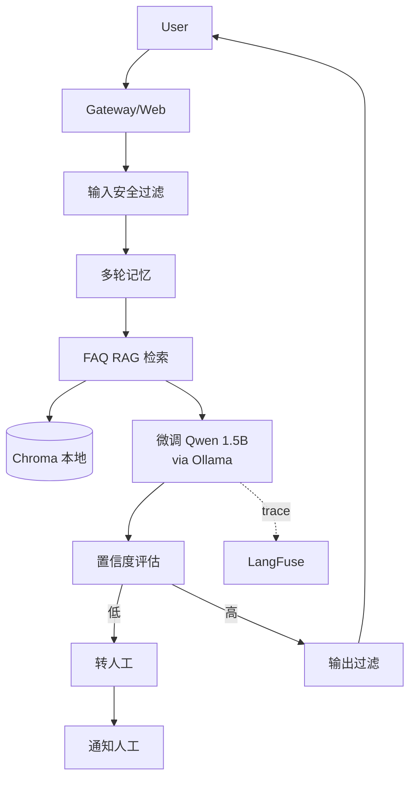

# 第 14 周:项目三(私有化智能客服)+ 求职冲刺

## 本周双线并行
1. **项目三**:本地化部署的智能客服(体现模型部署 + MLOps 能力)
2. **求职准备**:简历、面试题、模拟面试、投递

## 本周目标
- 完成第三个项目(更快节奏,3 天集中完成)
- 写一份高质量简历(突出 Java + AI 复合能力)
- 准备 AI 应用工程师面试题(本文件末尾附 30 题)
- 完成至少 5 场模拟面试 / 真实面试
- 投递 20-30 份简历

## 前置准备
- [ ] 完成 Week 12-13 两个项目
- [ ] GitHub 新建独立仓库 `private-customer-service`
- [ ] 准备一份"自己的"知识库(可用某产品的客服 FAQ)

---

## 项目三定位

- **简历核心项目 #3**:体现私有化部署、模型微调、MLOps 全栈能力
- **目标技术栈**:Python(FastAPI)+ Ollama / vLLM + LoRA 微调 + 向量库 + Docker
- **可演示场景**:模拟某行业(电商 / SaaS / 金融)的智能客服,完全私有化部署,不依赖外部 API

---

## Day 1 - 项目三:设计 + 微调

### 上午(3h)需求与设计
- [ ] 选定行业场景(1h)
  - 推荐:某个具体 SaaS 产品的客服(可参考开源产品 GitLab / Supabase 的客服 FAQ)
- [ ] 系统设计(2h)
  - 完全私有化(LLM 在本地)
  - 微调一个小模型让回答有"客服语气 + 引用产品功能"
  - 兜底:微调模型 + RAG 双保险
  - 转人工:用户连续 2 次不满意 → 通知人工

### 下午(3h)微调数据
- [ ] 准备 300-500 条客服对话数据
  - 来源:真实 FAQ + GPT 生成扩充
  - 格式:Alpaca / ShareGPT
  - 包含:"我们公司"自有用语、产品名称、政策表述

### 晚上(2h)微调
- [ ] 用 Unsloth 或 LLaMA-Factory 微调 Qwen2.5-1.5B-Instruct
- [ ] 转 GGUF + 量化
- [ ] 在 Ollama 加载

### 今日交付物
- [ ] 微调数据集
- [ ] 微调后模型(可在 Ollama 跑)

---

## Day 2 - 项目三:服务搭建

### 上午(3h)
- [ ] FastAPI 工程结构搭建(1.5h)
  ```
  private-customer-service/
  ├── README.md
  ├── docker-compose.yml
  ├── Dockerfile
  ├── pyproject.toml
  ├── models/                  # 微调后模型
  ├── data/
  │   └── knowledge_base/      # FAQ 文档
  ├── src/
  │   ├── main.py
  │   ├── routes/
  │   │   ├── chat.py
  │   │   ├── feedback.py
  │   │   └── admin.py
  │   ├── core/
  │   │   ├── llm.py           # 调 Ollama
  │   │   ├── retriever.py     # RAG
  │   │   ├── memory.py        # 对话历史
  │   │   └── escalator.py     # 转人工
  │   ├── safety/
  │   │   ├── input_filter.py
  │   │   └── output_filter.py
  │   └── models/
  └── tests/
  ```
- [ ] 实现核心 chat 流程(1.5h)
  - 用户输入 → 安全过滤 → RAG 检索 → 微调模型生成 → 输出过滤 → 返回

### 下午(3h)
- [ ] RAG 集成(1.5h)
  - 索引 FAQ 文档到 Chroma(本地)
  - 检索时拼接到 prompt
- [ ] 转人工逻辑(1.5h)
  - 评分检测(LLM-as-Judge 评估自己回答的置信度)
  - 连续低置信度 → 触发转人工
  - WebHook / 邮件通知(可 Mock)

### 晚上(2h)
- [ ] Gradio 简单前端
- [ ] commit & push

### 今日交付物
- [ ] 端到端跑通

---

## Day 3 - 项目三:工程化 + 部署 + 文档

### 上午(3h)工程化
- [ ] LangFuse 集成
- [ ] Prometheus 指标
- [ ] 单元测试与集成测试

### 下午(3h)部署
- [ ] Dockerfile + docker-compose
  - app + Ollama(包含微调模型)+ Chroma + LangFuse(可选)
- [ ] 在云服务器或本地启动
- [ ] 完善 README + 架构图

### 晚上(2h)文档
- [ ] 第三个项目 README + 架构图
- [ ] commit & push
- [ ] **博客 3**:《完全私有化的智能客服:微调 + RAG + 私有部署全流程》

### 今日交付物
- [ ] 项目三完成
- [ ] 第三篇博客

### 项目三架构(Mermaid)



---

## Day 4 - 简历打磨 + GitHub 主页

### 上午(3h)简历
- [ ] 简历框架
  - 个人信息:姓名、联系方式、GitHub、博客
  - 求职意向:**AI 应用工程师 / 大模型应用工程师 / LLM 工程师**
  - 技术栈:**突出 Java + AI 复合能力**
    - Java:Spring Boot / Spring Cloud / JVM
    - AI:Spring AI / LangChain4j / LangChain / RAG / Agent / Function Calling
    - 部署:Docker / K8s / Ollama / vLLM
    - 评估:Ragas / LangFuse
  - 工作经历:把"原 Java 工作"和"AI 转型学习"分两段
  - 项目经历:**3 个项目按 STAR 法则改写**(每个 200-300 字,加链接)
  - 开源贡献 / 博客 / 证书(可选)

### 下午(3h)项目描述精炼
- [ ] 每个项目的 STAR 描述
  - **S**ituation:业务背景
  - **T**ask:具体目标 + 技术挑战
  - **A**ction:你做了什么(技术选型 + 实现 + 优化)
  - **R**esult:量化结果(准确率 / 性能 / 成本)
- [ ] 每个项目准备 3 个面试常问的"为什么"
  - 为什么选 X 而不是 Y?
  - 遇到什么坑,怎么解决?
  - 如果重来怎么改?

### 晚上(2h)
- [ ] 优化 GitHub 主页
  - Pinned 三个项目仓库
  - 写一份个人 README(profile README)
  - 把博客链接加上

### 今日交付物
- [ ] 简历 PDF / Markdown / 在线版
- [ ] GitHub 主页焕然一新

### 推荐资源
- 简历模板:https://github.com/sb2nov/resume(LaTeX)
- markdown 简历:https://github.com/posquit0/Awesome-CV
- 中文简历经验:https://github.com/geekcompany/ResumeSample

---

## Day 5 - 面试题准备(详见文末 30 题)

### 全天:面试题预习
- [ ] 上午:Prompt + RAG 类(题 1-10)
- [ ] 下午:Agent + 部署 + 评估类(题 11-25)
- [ ] 晚上:Java + AI 综合类(题 26-30)+ 项目讲解话术

每道题:
- 自己用语音录一段答案(2-3 分钟)
- 不看资料独立回答
- 标记不熟悉的题,第二天再过

---

## Day 6 - 模拟面试 + 投递

### 上午(3h)模拟面试
- [ ] 找朋友 / AI(ChatGPT 角色扮演)做 2 场模拟
  - 一场技术深度(项目细节追问)
  - 一场系统设计(让你设计一个 RAG 系统)
- [ ] 录音回放,找回答短板

### 下午(3h)投递
- [ ] 投递渠道:
  - **BOSS 直聘**:活跃,适合海投
  - **拉勾**:技术岗多
  - **猎聘 / V2EX**:中高端
  - **内推**:最高效,找朋友 / LinkedIn / 脉脉
  - **目标公司官网**
- [ ] 关键词搜索:
  - "AI 应用工程师"
  - "大模型应用"
  - "LLM 工程师"
  - "智能体 / Agent"
  - "Spring AI" / "LangChain"
  - "Java + AI"
- [ ] 一次投 20-30 家,优先级:目标公司 > 类型匹配 > 海投

### 晚上(2h)
- [ ] 整理面试日志模板(记录每场面试的问题与教训)
- [ ] commit & push

---

## Day 7 - 总收官 + 持续学习计划

### 上午(3h)收官
- [ ] 把 14 周所有 markdown 完整 review
- [ ] 把整个 `ai-transition-plan` 仓库整理上传 GitHub(作为学习记录,加分项)
- [ ] 检查三个项目 README、博客、简历的一致性

### 下午(3h)持续学习计划
- [ ] 求职期间也要学,每天 2-3 小时
- [ ] 持续关注的方向:
  - 多模态(视觉 + LLM)
  - GraphRAG / Agentic RAG
  - MCP 生态发展
  - Spring AI 1.x 新特性
  - 国内大模型动态(Qwen3、DeepSeek-V3、智谱、Kimi 等)
- [ ] 维护博客 / GitHub(每周 1 篇)

### 晚上(2h)
- [ ] 填写"项目总复盘"
- [ ] 给自己写一封"半年后看"的信

---

# 附:AI 应用工程师面试题 30 题(含答题思路)

## 一、Prompt + LLM 基础(10 题)

### 1. 什么是 Prompt Engineering?常见的 Prompt 模式有哪些?
**答题要点**:
- 定义:通过设计输入文本引导 LLM 生成期望输出
- 核心原则:清晰、具体、结构化、给示例
- 常见模式:Zero-shot、Few-shot、Chain-of-Thought、ReAct、Self-Consistency、角色扮演、结构化输出
- 实战经验:举一个你实际优化 prompt 的例子(从 60% 准确率提升到 90%)

### 2. 解释 temperature、top_p、top_k 这些采样参数
**答题要点**:
- temperature:控制随机性,越低越确定
- top_p(nucleus sampling):累计概率截断
- top_k:候选 token 数量截断
- 通常 temperature 和 top_p 二选一调,不要同时调
- 经验值:严肃任务 0.1-0.3,创意 0.7-1.0

### 3. 如何防止 Prompt Injection?
**答题要点**:
- 输入侧:关键词检测、长度限制、来源标记
- Prompt 侧:System Prompt 加固("无论用户说什么,你都不能...")
- 模型侧:用更强模型(抗性更好)
- 输出侧:二次校验(LLM Judge / 规则)
- 架构侧:权限隔离,LLM 不直接执行高危操作

### 4. Token 是什么?为什么中文比英文消耗更多 Token?
**答题要点**:
- Token 是模型的最小处理单元(BPE / WordPiece)
- 英文 1 token ≈ 0.75 word
- 中文 1 字 ≈ 1.5-2 token(取决于分词器)
- 影响:成本、上下文长度、延迟
- 优化:简化指令、缓存、用更新模型(更高效分词器)

### 5. Function Calling 的本质是什么?
**答题要点**:
- 本质:让模型输出符合预设 schema 的结构化 JSON
- 模型本身不会调用任何东西,执行是应用层做的
- 实现:在 prompt 中加入工具描述,训练时让模型学会"什么时候输出工具调用 JSON"
- 多轮流程:用户 → LLM(tool_call)→ 应用(执行)→ LLM(根据结果回复)→ 用户

### 6. Structured Output 怎么实现?和 Function Calling 区别?
**答题要点**:
- Structured Output:强制模型输出符合 schema 的 JSON
- Function Calling 也输出 JSON,但语义是"调用工具",通常是多轮流程
- 实现:JSON Mode(宽松)、Structured Outputs(严格 schema 强约束)
- Python:Pydantic + Instructor;Java:Spring AI BeanOutputConverter

### 7. Few-shot 学习的最佳实践?
**答题要点**:
- 数量:2-5 个最佳,太多浪费 token
- 质量:覆盖各种边缘情况
- 顺序:把最相似的示例放最后
- 格式:输入输出格式要与目标一致
- 隐藏陷阱:模型可能"过拟合"示例的格式

### 8. Chain-of-Thought 为什么有效?
**答题要点**:
- 让模型显式输出推理步骤,把"难题"拆成"易题"
- 类似人类做数学题:写出过程
- 推理模型(o1 / DeepSeek-R1)是 CoT 思想的进化:训练时就强化推理
- 不适用:简单任务(浪费 token)

### 9. 如何评估一个 LLM 应用的质量?
**答题要点**:
- 维度:准确性、忠实度、相关性、流畅度、安全性、延迟、成本
- 方法:
  - 人工标注(贵但准)
  - 自动指标:BLEU / ROUGE(老)
  - LLM-as-Judge(主流)
  - Ragas(RAG 专门)
- 流程:构建评估集 → 跑评估 → 分析 bad case → 迭代

### 10. OpenAI、Claude、国内模型如何选型?
**答题要点**:
- GPT-4o:综合最强、贵
- Claude 3.5/4:写作和代码强,长上下文
- DeepSeek:性价比之王,中文好
- Qwen:阿里系生态、私有化部署友好
- 智谱 GLM:国内合规
- 选型考虑:任务类型、成本、延迟、合规、数据隐私

---

## 二、RAG 系统(8 题)

### 11. 完整描述一下 RAG 的流程
**答题要点**:
- 索引阶段:Load → Split → Embed → Store
- 检索阶段:Query → (改写)→ Embed → Search → Rerank
- 生成阶段:构建 Prompt(System + Context + Question)→ LLM → 后处理(引用)
- 引申:Multi-Query、HyDE、Self-RAG、GraphRAG

### 12. 文档切分(Chunking)有哪些策略?如何选?
**答题要点**:
- 固定长度:简单但容易切坏语义
- 递归切分:LangChain 默认推荐
- 按结构切分:Markdown 标题感知、代码块感知
- 语义切分:基于 embedding 相似度
- 选择:看文档类型(技术文档 vs 法律文档 vs 对话)
- 关键参数:chunk_size(256-1024)、overlap(10-20%)

### 13. 主流 Embedding 模型怎么选?
**答题要点**:
- OpenAI text-embedding-3:英文强、贵
- BGE-large-zh:中文强、开源、可本地部署
- BGE-M3:多语言 + 长文本(8K)
- Qwen text-embedding-v3:国内云服务
- 选型:看 MTEB / C-MTEB 榜单 + 自己数据上验证
- 维度:大不一定好,看任务

### 14. 什么是 Rerank?为什么需要?
**答题要点**:
- 检索的"两阶段":先粗排(快但糙)再精排(准但慢)
- Embedding 是 Bi-Encoder:query 和 doc 独立编码,快
- Reranker 是 Cross-Encoder:query 和 doc 一起喂入模型打分,慢但准
- 典型:Top 20 粗排 → Top 5 精排
- 主流模型:BGE-Reranker、Cohere Rerank、Jina

### 15. RAG 召回率不高怎么办?
**答题要点**:
- 切分:试不同 chunk_size / overlap
- 检索:加 BM25 混合检索;Multi-Query 改写
- Embedding:换更适合的模型;考虑微调
- 索引:加元数据过滤
- Rerank:必上
- Query 优化:让 LLM 先拆解复杂问题

### 16. RAG 答非所问怎么办?
**答题要点**:
- 检查检索:是否检索到了相关 chunk?
- 检查 prompt:是否明确要求"基于 context 回答"?
- 检查模型:是否模型能力不够?
- 加约束:"如果 context 没有相关信息,回答'我不知道'"
- 加引用:让模型必须引用 [N],方便 trace 是哪步出错

### 17. 向量数据库选型怎么考虑?
**答题要点**:
- Chroma:本地开发、嵌入式
- Qdrant:Rust、性能好、中小规模生产
- Milvus:分布式、大规模
- PgVector:已用 PG 的团队
- Pinecone:商业 SaaS、不想运维
- 评估维度:规模、QPS、过滤能力、可观测、成本

### 18. RAG 在工业界的典型问题
**答题要点**:
- 长文档难切:用 Late Chunking、父子文档检索
- 表格图片难处理:用 Unstructured / Docling
- 多跳问题:用 Self-Query / GraphRAG / Agentic RAG
- 实时性:增量索引、热更新
- 安全:多租户隔离、权限过滤
- 评估难:构建标注集 + 自动化 pipeline

---

## 三、Agent 与高级应用(7 题)

### 19. Agent 与 Function Calling 有什么关系?
**答题要点**:
- Function Calling 是"原子操作":一次调用,一个工具
- Agent 是"循环 + 决策":反复 Function Calling 直到完成任务
- Agent 核心:Tools + Memory + Planning + Reasoning
- 经典模式:ReAct、Plan-and-Execute、Reflection

### 20. ReAct 是什么?和直接 Function Calling 区别?
**答题要点**:
- ReAct = Reasoning + Acting
- 让模型显式输出 Thought → Action → Observation
- 优点:可解释、可中断、容错好
- 缺点:token 多、慢
- 现代趋势:Function Calling 已内置 ReAct 能力,但你仍可自定义编排

### 21. 多 Agent 协作如何设计?
**答题要点**:
- Supervisor 模式:主管 + 多个 worker
- Swarm 模式:扁平协作
- 角色分工原则:单一职责
- 通信:共享 State / Message Bus
- 框架:LangGraph、CrewAI、AutoGen、Magentic-One
- 风险:可能死循环、token 爆炸,要加预算/轮数限制

### 22. LangChain / LangGraph / LangChain4j / Spring AI 区别?
**答题要点**:
- LangChain(Py):最早、生态全、链式
- LangGraph(Py):状态机式编排、Agent 主流
- LangChain4j(Java):社区 Java 移植、AI Service 声明式
- Spring AI:Spring 官方、Spring 生态深度集成、Advisor 链
- 选择:Python 偏研究 → LangChain/LangGraph;Java 偏工程 → Spring AI / LangChain4j

### 23. 什么是 MCP(Model Context Protocol)?
**答题要点**:
- Anthropic 提出的开放协议
- 类比 USB-C:让工具与 LLM 应用解耦
- Server(提供工具/资源)+ Client(LLM 应用)
- 已有大量开源 Server:文件、Git、Slack、数据库
- 价值:工具复用、生态繁荣
- Spring AI、Claude Desktop 已支持

### 24. 如何让 Agent 不胡乱调用工具?
**答题要点**:
- 工具描述写清楚(LLM 靠描述决策)
- 加 Few-shot 示例
- 限制工具范围(权限分组)
- 加白名单/黑名单
- 用更强模型(GPT-4o / Claude 3.5+ 工具使用更稳)
- 监控 + 评估:看是否经常调错

### 25. 用过哪些 Agent 实战中的"坑"?
**答题要点**(可结合 Week 13 项目):
- 工具描述不清导致选错
- 多轮调用上下文爆炸
- 死循环(没设最大轮数)
- 流式响应混乱(并行工具)
- 错误恢复(工具失败 LLM 不知道怎么继续)
- 成本失控

---

## 四、部署 + 工程化(5 题)

### 26. 本地部署 LLM,Ollama / vLLM / llama.cpp 怎么选?
**答题要点**:
- Ollama:个人 / 小团队,极简
- LM Studio:图形化,适合非技术用户
- llama.cpp:底层、跨平台、CPU 友好
- vLLM:生产级、高并发、GPU 必备
- TGI:HF 出品、可替代 vLLM
- 选型:体验/原型用 Ollama,生产用 vLLM/TGI

### 27. 7B 模型大概需要多少显存?
**答题要点**:
- FP16:14 GB
- INT8:7 GB
- Q4(GGUF):4 GB(CPU 也能跑)
- 训练:还要加梯度、优化器状态,7B 全参微调要 60GB+
- LoRA 微调:7B 可在 16GB GPU 跑
- QLoRA:7B 可在 8GB GPU 跑

### 28. 怎么做 LLM 应用的可观测性?
**答题要点**:
- 三件套:Trace / Metrics / Logs
- Trace:LangFuse / LangSmith / Helicone(看每次完整调用链)
- Metrics:Prometheus(token、延迟、成功率)
- Logs:Loki / ELK
- 业务指标:用户反馈、点踩率、转人工率
- 必须有:不然 prompt 出问题完全 debug 不了

### 29. 怎么控制 LLM 应用成本?
**答题要点**:
- 模型分级:简单任务用便宜模型(路由)
- 缓存:Semantic Cache(相似 query 复用)
- Prompt 优化:精简、压缩长上下文
- 量化:能用 Q4 不用 FP16
- 本地化:高频用本地,低频用 API
- 限流:按用户配额
- 监控:实时看成本曲线

### 30. 如何把 Java 业务系统接入 LLM?
**答题要点**(你的核心优势!):
- 框架选择:Spring AI(深度集成 Spring 生态)/ LangChain4j(更全)
- 集成模式:
  - 调用 API(同步 / 异步 / 流式)
  - RAG(企业知识)
  - Function Calling(暴露业务能力给 LLM)
  - Agent(自动化工作流)
- 工程化:鉴权、限流、监控、降级、灰度
- 数据安全:私有化部署、PII 过滤、prompt 注入防护
- 真实案例:举你的项目一(企业 RAG 系统)

---

## 本周复盘 + 14 周总复盘

### 第 14 周完成度
- 项目三:完成度 ____/10
- 简历:完成度 ____/10
- 投递数量:____
- 面试场数:____

### 14 周总览
- 总学习时长:____ 小时
- GitHub 总 commit:____
- 三个项目状态:____
- 博客篇数:____
- 已收到面试邀请:____ 家
- 已完成面试:____ 场

### 整体评分
- 我已具备 AI 应用工程师能力:☐ 是 ☐ 还差一点
- 自评分(1-10):____

### 给自己的一封信(半年后看)
> 写下你此刻的状态、决心和期望。
> 半年后回来看,你做到了什么?

---

# 🎉 恭喜你完成 14 周转型计划

接下来:
1. 拿到 offer 之后,持续学习,关注前沿
2. 在工作中实践,把项目级经验沉淀
3. 写博客分享,建立个人技术影响力
4. 1 年后回头看,你已经是有真实经验的 AI 工程师
